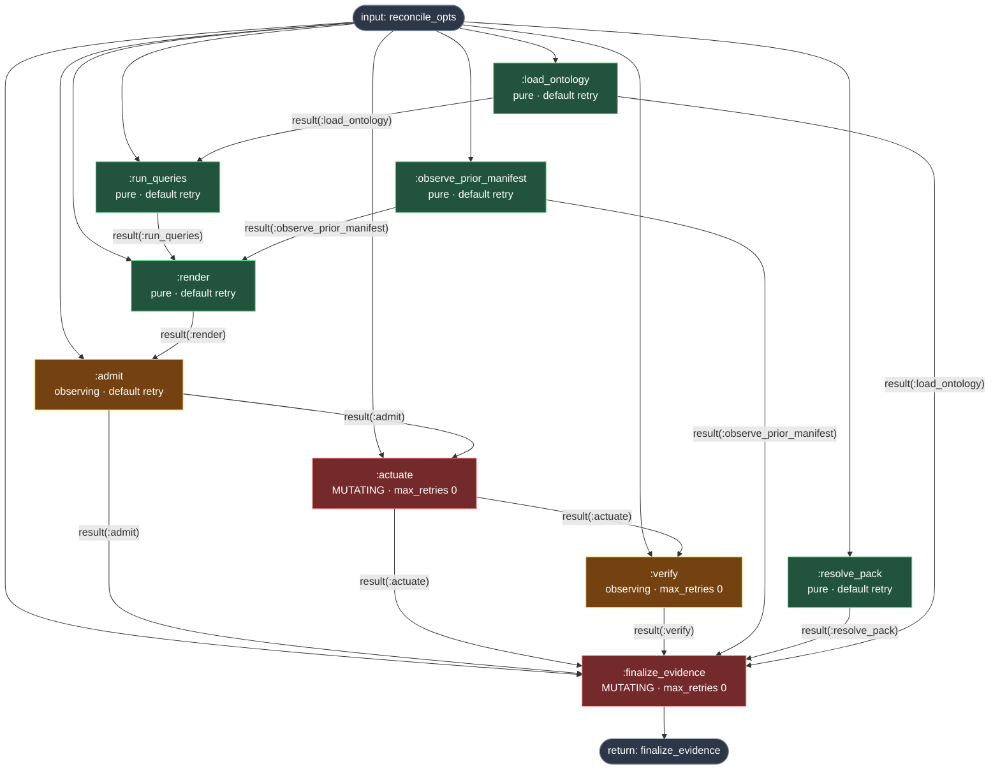

# ReconcileReactor Step Dependency Graph

Source of truth: `lib/ggen_igniter/reactors/reconcile_reactor.ex` (real `step`/
`argument`/`return` DSL declarations, read directly from disk on
2026-08-27 during a Reactor step-decomposition audit — not hand-drawn from
the moduledoc prose). Regenerate this file by re-reading the module if the
step DSL changes; it is a derived artifact, not a second source of truth.

## Dependency graph (from real `argument input(...)`/`result(...)` declarations)



`:observe_prior_manifest`, `:load_ontology`, and `:resolve_pack` share only
the `:reconcile_opts` input as a dependency, so Reactor's own scheduler runs
them concurrently — no manual concurrency management in this pipeline for
that part of the graph.

## Per-step audit table (real declarations, this pass)

| Step | Inputs (`argument`) | Output (`run` return) | Side effect | `max_retries` | Compensation |
|---|---|---|---|---|---|
| `:observe_prior_manifest` | `reconcile_opts` ← input | `%{manifest_dir, manifest}` | pure (real read: `Manifest.load/1`) | default (unset — safe: idempotent read) | none needed |
| `:load_ontology` | `reconcile_opts` ← input | `%{ontology_path, graph}` | pure (real read: `Ontology.load!/1`) | default (unset — safe: idempotent read) | none needed |
| `:resolve_pack` | `reconcile_opts` ← input | `%{pack_dir}` | pure (real read: `Pack.resolve_dir!/1`) | default (unset — safe: idempotent read) | none needed |
| `:run_queries` | `reconcile_opts` ← input, `ontology` ← result(`:load_ontology`) | `%{targets: [...]}` | pure (in-memory query exec over already-loaded graph) | default (unset — safe: deterministic) | none needed |
| `:render` | `queried` ← result(`:run_queries`), `observed` ← result(`:observe_prior_manifest`), `reconcile_opts` ← input | `%{pending, recipes, exec}` (the plan) | pure (real template reads, no writes) | default (unset — safe: deterministic) | none needed |
| `:admit` | `render` ← result(`:render`), `reconcile_opts` ← input | `%{pending, recipes, exec, stale_paths, on_stale}` or `{:error, reason}` | observing (telemetry only, no fs mutation) | default (unset — safe: no mutation to redo) | none needed |
| `:actuate` | `admitted` ← result(`:admit`), `reconcile_opts` ← input | `%{results, tracked}` | **mutating** (real file writes/evals) | **`0`** (explicit) | `compensate/4` (self-heal already handled in `run/3`, returns `:ok`) **+** `undo/4` (real file revert + `FILES_RESTORED`/`COMPENSATION_COMPLETED` telemetry) |
| `:verify` | `actuated` ← result(`:actuate`), `reconcile_opts` ← input | `:verified` or `{:error, {:compile_failed, output}}` | observing (real `mix compile` subprocess check) | **`0`** (explicit) | none of its own — a failure here is a later-step failure that triggers `:actuate`'s `undo/4` |
| `:finalize_evidence` | `verify`, `admitted`, `actuated`, `observed`, `pack`, `ontology` ← results, `reconcile_opts` ← input | final `Receipt.t()` | **mutating** (`Receipt.append!/2`, `Manifest.persist!/2`, real `Manifest.prune!/1` deletions) | **`0`** (explicit — **fixed this pass**, was previously unset) | none of its own (terminal step; nothing it writes needs reverting on its own failure — see ordering fix below) |

`return :finalize_evidence` — the pipeline's public result.

## Real fixes applied this pass (2026-08-27, Reactor step-decomposition audit)

1. **`max_retries 0` added to `:finalize_evidence`.** It was the only
   mutating/actuation-class step without an explicit retry policy (`:actuate`
   and `:verify` both already had it). Empirically confirmed against
   `deps/reactor/lib/reactor/executor/step_runner.ex` that a step with no
   `compensate/4` funnels any `{:error, _}`/raised exception straight to
   `{:error, error}` (no implicit retry loop is actually exercised as the
   code stood) — so this is a defensive, explicit-policy hardening rather
   than a fix for a live retry bug, made so a future `compensate/4` addition
   can't silently reintroduce retries on a step with real durable side
   effects (an append-only receipt write in particular must never be
   re-run).

2. **Real correctness bug fixed: unguarded `Manifest.prune!/1` call inside
   `finalize_evidence/1`, positioned AFTER the receipt was already durably
   persisted.** Confirmed via `Manifest.prune!/1`'s own real contract
   (`lib/ggen_igniter/manifest.ex:284-299`): it raises `RuntimeError` on any
   unexpected `File.rm/1` failure (e.g. a permissions error) — not only on
   `:enoent`. Before this fix, that raise would:
     - fail the whole `:finalize_evidence` step (confirmed via
       `deps/reactor/lib/reactor/executor/step_runner.ex:171-177`'s `rescue`
       → `maybe_compensate` → no `compensate/4` on this step → plain
       `{:error, error}`);
     - since `:finalize_evidence` is a LATER step than `:actuate`, trigger
       Reactor's real `undo/4` on `:actuate` (confirmed via
       `deps/reactor/lib/reactor/executor/sync.ex:93-97`'s
       `{:error, reason} -> {:undo, ...}` path), reverting the very files the
       receipt — written one step earlier, at line "-- 2. Persist the
       receipt FIRST" — had just durably recorded as `standing: :alive`;
     - and cause `run/1`'s own `{:error, _}` branch to persist a SECOND,
       contradictory `:compensated` receipt line for the same physical
       attempt (`standing_for_failure/2` maps `:finalize_evidence` to
       `:compensated`).

   Fixed by wrapping the prune call in a local `try/rescue`, exactly
   mirroring the existing `manifest_promotion` pattern immediately above it
   in the same function (same rationale: a real receipt, once durably
   written and describing genuinely-written-and-verified files, must not be
   contradicted by a secondary bookkeeping action failing). The real
   outcome (`{:pruned, results}` / `{:prune_failed, message}` /
   `:not_applicable`) is now recorded in `receipt.metadata["prune_outcome"]`
   and in the `STANDING_SET` telemetry event, the same way
   `manifest_promotion` already was.

3. **Explicit `# side_effect: pure | observing | mutating` classification
   comment added above every one of the 9 `step` blocks**, matching the
   moduledoc's existing prose descriptions but making the classification
   inspectable at each step's own declaration site rather than only in the
   ~250-line moduledoc above it.

No new steps were invented; every change hardens an existing step's
already-declared behavior.

## Verification run this pass

```
$ mix compile --warnings-as-errors        # exit 0, ggen_igniter app generated clean
$ mix test test/ggen_igniter_reconcile_reactor_test.exs \
           test/ggen_igniter_finalize_evidence_ordering_test.exs \
           test/ggen_igniter_receipt_compensated_test.exs \
           test/ggen_igniter_pending_actuation_test.exs
9 tests, 0 failures

$ grep -rn "Mock|mock(|patch(|monkeypatch" test lib native
(no matches)
```

See `~/ggen_igniter/lib/ggen_igniter/reactors/reconcile_reactor.ex` for the
real, current step declarations this graph is derived from.
