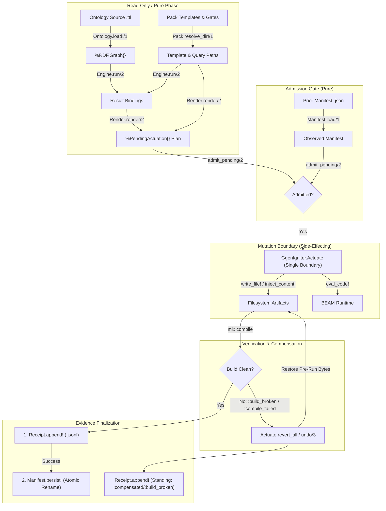

# Component Boundaries & Ownership

> [!NOTE]
> **Core Architectural Principle:** In this documentation suite, **observed implementation outranks intended architecture**.
> Every architectural claim is explicitly labeled with its empirical status: `IMPLEMENTED`, `PARTIAL_ALIVE`, `PLANNED`, `UNSUPPORTED`, or `DEPRECATED`.

This document establishes the strict boundaries, data contracts, and mutation ownership across the `ggen_igniter` system.

---

## 1. Ownership & Mutation Matrix

| Layer / Component | Permitted Side-Effects / Mutations | Forbidden Operations | Implementation Status |
|---|---|---|---|
| **Semantic Ingestion** (`Ontology`, `Pack`) | Read-only filesystem operations (`File.read!/1`, directory walking). | Must NOT mutate input Turtle files, templates, or project code. | `IMPLEMENTED` |
| **Query Engine** (`Engine.*`, `Native.GraphNif`) | In-memory evaluation over `%RDF.Graph{}` or remote SPARQL HTTP queries (`QLever`). | Must NOT write files, modify OTP application env, or leak native pointers. | `IMPLEMENTED` |
| **Planning & Rendering** (`Render.*`, `Frontmatter`) | Pure in-memory string and template rendering producing `%PendingActuation{}`. | Must NOT touch the filesystem, create directories, or mutate global process state. | `IMPLEMENTED` |
| **Admission Gate** (`ReconcileReactor:admit`) | Pure in-memory plan validation. | Must NOT write files. Must fail closed on duplicate outputs, stale-refusal, or unowned deletes. | `IMPLEMENTED` |
| **Actuation Boundary** (`Actuate.*`, `ReconcileReactor:actuate`) | Single mutation boundary: writes files (`write_file!/3`), injects text (`inject_content!/5`), or executes code (`eval_code!/2`). Reverts writes on error. | Must NOT perform AST transformations not backed by safe primitives; must NOT proceed without admission. | `IMPLEMENTED` |
| **Verification Boundary** (`ReconcileReactor:verify`) | Spawns verification subprocess (`mix compile --warnings-as-errors`). | Must NOT mutate source files directly. | `IMPLEMENTED` |
| **Evidence & Manifest** (`Manifest`, `Receipt`, `OcelEmitter`) | Appends JSONL run receipts (`Receipt.append!/2`), atomically persists manifest snapshots (`Manifest.persist!/2`), emits `:telemetry`. | Must NOT promote manifest before receipt write succeeds; must NOT delete unowned files. | `IMPLEMENTED` |
| **Control Plane** (`Controller`) | In-process state tracking (`GenServer`), call dispatch. | Must NOT leak uncaught pipeline crashes to caller processes. | `IMPLEMENTED` |
| **CLI Adapter** (`Mix.Tasks.GgenIgniter.Sync`, `Doctor`) | Command-line parsing, delegation to Controller or standalone pipeline, terminal output. | Must NOT duplicate core pipeline business logic. | `IMPLEMENTED` |

---

## 2. Component Boundaries & Information Flow

---

## 3. Strict Boundary Rules

### 3.1. Single Actuation Boundary
All physical side-effects on disk or runtime execution are quarantined to `GgenIgniter.Actuate` and the `:actuate` reactor step. 
- No other module (e.g. `Render`, `Engine`, `Ontology`, `Manifest`) is permitted to create or overwrite project source code.
- `Actuate.write_file!/3` strictly enforces idempotency rules: if on-disk content matches the desired output byte-for-byte, write I/O is skipped (`:unchanged`).

### 3.2. Fail-Closed Admission Before Physical Actuation
The `:admit` step enforces structural invariants over the *entire* `%PendingActuation{}` plan before any write occurs:
1. **Collision Refusal (`:refused_duplicate_output_path`)**: If two independent query targets resolve to the identical output path in the same run, the entire attempt is refused immediately.
2. **Unowned Deletion Refusal (`:refused_unowned_delete`)**: Any stale-prune deletion where `ownership != true` is rejected.
3. **Stale Refusal (`:refused_stale_outputs`)**: Under `--on-stale refuse` (the default), the presence of any stale output path immediately halts execution before modifying disk.

### 3.3. Compensation Reversion vs. Stale Pruning
- **Compensation Reversion (`Actuate.revert_all/1` / `undo/3`)**: Triggered when verification fails. Restores pre-existing file content or removes newly created files.
- **Stale Pruning (`Manifest.prune!/1`)**: Triggered ONLY in `:finalize_evidence` after verification succeeds (`:verified`), ensuring stale paths are never deleted until new artifacts are proven valid.

### 3.4. Evidence Durability Order
Evidence finalization strictly follows a two-phase protocol (`ReconcileReactor:finalize_evidence`):
1. **Receipt First (`GgenIgniter.Receipt.append!/2`)**: Appends the run receipt to `.ggen_igniter/receipts/YYYY-MM-DD.jsonl`.
2. **Manifest Second (`GgenIgniter.Manifest.persist!/2`)**: Atomically writes and renames `.ggen_igniter/manifest.json`.

> [!CAUTION]
> If a receipt write fails, the entire run fails and triggers compensation. The manifest is never promoted before receipt durability is established.
