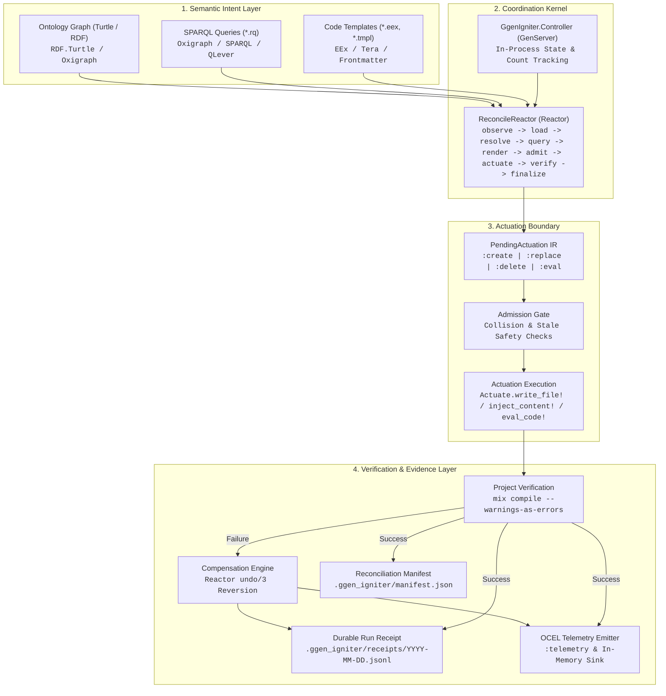

# System Architecture Overview

> [!NOTE]
> **Core Architectural Principle:** In this documentation suite, **observed implementation outranks intended architecture**.
> Every architectural claim is explicitly labeled with its empirical status: `IMPLEMENTED`, `PARTIAL_ALIVE`, `PLANNED`, `UNSUPPORTED`, or `DEPRECATED`.

`ggen_igniter` is an autonomic software manufacturing pipeline designed for the BEAM ecosystem. It bridges semantic compilation (RDF graph queries, SPARQL, and templating) with project actuation, code reconciliation, and verifiable execution evidence.

---

## 1. High-Level Pipeline Architecture

The manufacturing pipeline continuously reconciles declarative semantic intent (ontologies, knowledge graphs, schemas) into concrete project artifacts (source code, configuration, database schemas, runtime evaluation) while guaranteeing strict fault boundaries, compensation upon verification failure, and durable evidence projection.

---

## 2. Component Capabilities & Implementation Status

| Component | Role / Purpose | Implementation Status | Implementation Evidence |
|---|---|---|---|
| **`GgenIgniter.Ontology`** | In-memory RDF Turtle parser and graph loader | `IMPLEMENTED` | `lib/ggen_igniter/ontology.ex`: wraps `RDF.Turtle.read_file!/1` returning `%RDF.Graph{}`. |
| **`GgenIgniter.Engine`** | Multi-backend SPARQL query execution abstraction (`oxigraph`, `sparql`, `qlever`) | `IMPLEMENTED` | `lib/ggen_igniter/engine.ex`: Behaviour registry. Default is `oxigraph` (NIF). |
| **`GgenIgniter.Native.GraphNif`** | Native Rust NIF binding to Oxigraph SPARQL 1.1 engine | `IMPLEMENTED` | `lib/ggen_igniter/native/graph_nif.ex`: compiles `native/ggen_graph_nif` via Rustler. |
| **`GgenIgniter.Render`** | Template engine abstraction for EEx and Tera | `IMPLEMENTED` | `lib/ggen_igniter/render.ex`, `lib/ggen_igniter/render/tera.ex`. |
| **`GgenIgniter.PendingActuation`** | Plan IR representing deferred create, replace, eval, and delete intents | `IMPLEMENTED` | `lib/ggen_igniter/pending_actuation.ex`: captures pre-image, desired hash, operation, and rollback data. |
| **`GgenIgniter.Reactors.ReconcileReactor`** | Declarative orchestration kernel executing the 9-stage reconciliation spine | `IMPLEMENTED` (Opt-in) | `lib/ggen_igniter/reactors/reconcile_reactor.ex`: `use Reactor`, complete with compensation and verification. |
| **`GgenIgniter.Controller`** | Persistent BEAM `GenServer` managing in-process reconciliation counters and state | `IMPLEMENTED` | `lib/ggen_igniter/controller.ex`: `start_link/1`, `reconcile/3`, `status/2`. |
| **`GgenIgniter.Manifest`** | Current-state cache (`manifest.json`) tracking recipe-to-output ownership | `IMPLEMENTED` | `lib/ggen_igniter/manifest.ex`: atomic rename persistence, stale output detection. |
| **`GgenIgniter.Receipt`** | Append-only audit trail (`.jsonl`) recording attempt standings (`:alive`, `:refused`, `:compensated`, `:build_broken`) | `IMPLEMENTED` | `lib/ggen_igniter/receipt.ex`: date-partitioned JSONL, cryptographic content hash pairs. |
| **`GgenIgniter.Telemetry.OcelEmitter`** | Object-Centric Event Log emitter and `:telemetry` integration | `IMPLEMENTED` | `lib/ggen_igniter/telemetry/ocel_emitter.ex`: emits `ACTUATION_STARTED`, `FILES_CHANGED`, `COMPENSATION_STARTED`, `FILES_RESTORED`. |
| **`GgenIgniter.Actuate`** | Write safety decision table, line/regex text injection, in-process code eval | `IMPLEMENTED` | `lib/ggen_igniter/actuate.ex`: `write_file!/3`, `inject_content!/5`, `eval_code!/2`. |
| **AST-Based Structural Mutation** | Igniter / Sourceror AST zipper transformations for incremental elixir code edits | `PLANNED` | `lib/ggen_igniter/actuate.ex:24-28` discloses that structural AST zipper editing is deferred; text splice (`inject_content!/5`) is implemented. |
| **Ash Framework Integration** | Ash domain/resource code generation and Ash.Reactor integration | `PARTIAL_ALIVE` | ReconcileReactor uses standalone `use Reactor` (not `Ash.Reactor`) to ensure zero mandatory Ash dependency. Ash templates supported via packs. |
| **Distributed Multi-Node Control Plane** | Distributed clustering and multi-node supervision of reconciliation workers | `PLANNED` | `lib/ggen_igniter/controller.ex:49-54` scopes Controller to single-node in-process state. |

---

## 3. Core Subsystems

### 3.1. ggen: The Semantic Compilation Engine
`ggen` concepts are realized in Elixir via RDF graph ingestion and SPARQL projection:
- **Ontology Ingestion**: RDF definitions are parsed into `%RDF.Graph{}` structs (`GgenIgniter.Ontology`).
- **Engine Execution**: SPARQL queries extract tabular result sets (`GgenIgniter.Engine.Oxigraph` via Rust NIF, `GgenIgniter.Engine.Sparql`, or `GgenIgniter.Engine.Qlever` over HTTP). Single-row queries are automatically flattened into top-level template bindings.
- **Rendering**: EEx and Tera templates render deterministic source files or dynamic in-process code expressions (`GgenIgniter.Render`).

### 3.2. Igniter: The Project Actuator
`ggen_igniter` integrates with the Igniter ecosystem:
- **CLI Interface**: Exposes `Mix.Tasks.GgenIgniter.Sync` and `Mix.Tasks.GgenIgniter.Doctor` implementing `Igniter.Mix.Task`.
- **Write-Safety Guards**: `Actuate.write_file!/3` applies idempotent write checks (`unless_exists`, `skip_if`, byte-identical skip `:unchanged`).
- **Injection Actuation**: `Actuate.inject_content!/5` performs deterministic, fail-closed line/regex anchor splices with duplicate protection.

### 3.3. Ash: Semantic Domain Modeling
- Ash DSL artifacts can be generated from RDF ontologies (e.g. `ash-lifecycle-pack`).
- Architectural boundary: `ggen_igniter` intentionally avoids a hard compile-time dependency on `Ash`. `Reactor` is used directly rather than `Ash.Reactor`, making Ash integration an optional, layered consumer capability.

### 3.4. Reactor: Coordination Kernel
`GgenIgniter.Reactors.ReconcileReactor` defines the autonomic reconciliation workflow as a formal dependency DAG:
1. `observe_prior_manifest` (Concurrent read)
2. `load_ontology` (Concurrent read)
3. `resolve_pack` (Concurrent read)
4. `run_queries` (Query evaluation)
5. `render` (Pure evaluation producing `PendingActuation` plan)
6. `admit` (Fail-closed admission verification)
7. `actuate` (Concurrent filesystem mutations via `Task.async_stream/3` with self-healing)
8. `verify` (Subprocess `mix compile --warnings-as-errors`)
9. `finalize_evidence` (Append-only receipt write followed by atomic manifest promotion)

### 3.5. OTP: Supervision and Persistence
- **GenServer Control Plane**: `GgenIgniter.Controller` maintains in-memory reconciliation continuity, key-based isolation, and non-disk-derivable metrics (`reconciliation_count`).
- **Supervision**: `GgenIgniter.Application` optionally supervises `GgenIgniter.Controller` when configured via `config :ggen_igniter, start_controller: true`.

### 3.6. OCEL & Evidence Projection
- Every lifecycle transition produces structured Object-Centric Event Log entries (`GgenIgniter.Telemetry.OcelEmitter`).
- Events are broadcast over Erlang `:telemetry` and captured in date-partitioned JSONL receipts (`GgenIgniter.Receipt`) providing cryptographic hashes (`pre_run_hash`, `post_run_hash`) for verified compensation auditability.

---

## 4. Key Architectural Invariants

> [!IMPORTANT]
> 1. **Idempotence & Safety:** Unchanged content is never re-written; existing unowned files are never silently deleted.
> 2. **Single Mutation Boundary:** Actuation is isolated exclusively to `GgenIgniter.Actuate` and the `:actuate` reactor step.
> 3. **Receipt Precedes Manifest:** During evidence finalization, the append-only receipt log MUST be successfully written before attempting atomic manifest promotion.
> 4. **Observable Proof over Claims:** All error handling and rollbacks are backed by real verification (e.g. `mix compile`), atomic filesystem operations, and cryptographic hashing.
