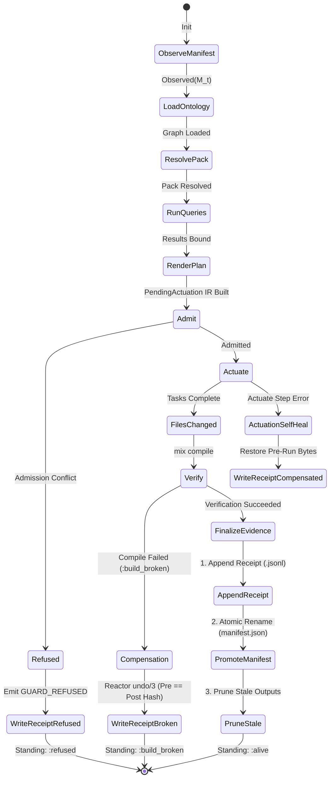

# Reconciliation Lifecycle & Mathematical Formalism

> [!NOTE]
> **Core Architectural Principle:** In this documentation suite, **observed implementation outranks intended architecture**.
> Every architectural claim is explicitly labeled with its empirical status: `IMPLEMENTED`, `PARTIAL_ALIVE`, `PLANNED`, `UNSUPPORTED`, or `DEPRECATED`.

This document formalizes the autonomic software reconciliation cycle implemented in `GgenIgniter.Reactors.ReconcileReactor` and `GgenIgniter.Reconcile`.

---

## 1. Mathematical Formulation

Let the state space of the system at discrete reconciliation epoch $t$ be defined by:
- $\mathcal{O}_t \in \mathcal{G}$: The semantic ontology graph (RDF triples / knowledge base).
- $\mathcal{P}$: The pack definition (SPARQL queries $Q$, templates $T$, routing rules $R$).
- $\mathcal{A}_t \in \mathcal{F}$: The physical project artifacts on disk (files, directories, source code).
- $\mathcal{M}_t \in \mathcal{K}$: The reconciliation manifest cache ($\text{recipe\_key} \mapsto \text{outputs}$).
- $\mathcal{E}_t \in \mathcal{L}$: The append-only evidence log (receipts and OCEL event sequences).

The autonomic reconciliation transition function $\mu$ computes the next system state:

$$(\mathcal{A}_{t+1}, \mathcal{M}_{t+1}, \mathcal{E}_{t+1}) = \mu(\mathcal{O}_{t+1}, \mathcal{A}_t, \mathcal{M}_t, \mathcal{P})$$

### 1.1. Detailed State Transformation Steps

1. **Observation & Ingestion:**
   $$\mathcal{G}_{t+1} = \text{Ontology.load!}(\mathcal{O}_{t+1})$$
   $$\mathcal{M}_t = \text{Manifest.load}(\text{base\_dir})$$

2. **Semantic Projection (Query & Render):**
   $$\mathcal{B} = \text{Engine.run}(\mathcal{G}_{t+1}, Q)$$
   $$\Delta_{\text{plan}} = \text{Render.plan}(T, \mathcal{B}, \mathcal{M}_t) = \{ \pi_1, \pi_2, \dots, \pi_k \}$$
   where each $\pi_i \in \text{PendingActuation}$ defines $(\text{target}, \text{prev\_hash}, \text{desired\_hash}, \text{op}, \text{compensation\_data})$.

3. **Admission Gate:**
   $$\text{Admit}(\Delta_{\text{plan}}, \mathcal{M}_t, \text{policy}) = \begin{cases}
   \text{OK}(\Delta_{\text{admitted}}) & \text{if invariant criteria met} \\
   \text{REFUSE}(\text{reason}) & \text{otherwise}
   \end{cases}$$

4. **Physical Actuation & Tracking:**
   $$\mathcal{A}' = \text{Actuate}(\mathcal{A}_t, \Delta_{\text{admitted}})$$

5. **Verification Gate:**
   $$\mathcal{V}(\mathcal{A}') = \begin{cases}
   \text{PASS} & \text{if } \texttt{mix compile --warnings-as-errors} \to 0 \\
   \text{FAIL}(\text{reason}) & \text{otherwise}
   \end{cases}$$

6. **Compensation or Finalization:**
   - If $\mathcal{V}(\mathcal{A}') = \text{FAIL}$:
     $$\mathcal{A}_{t+1} = \text{Undo}(\mathcal{A}', \text{tracked\_pre\_images}) = \mathcal{A}_t$$
     $$\mathcal{M}_{t+1} = \mathcal{M}_t$$
     $$\mathcal{E}_{t+1} = \mathcal{E}_t \cup \{ \text{Receipt}(\text{standing}: \text{:compensated} \mid \text{:build\_broken}) \}$$
   - If $\mathcal{V}(\mathcal{A}') = \text{PASS}$:
     $$\mathcal{A}_{t+1} = \mathcal{A}' \setminus \text{StalePrune}(\Delta_{\text{admitted}})$$
     $$\mathcal{E}_{t+1} = \mathcal{E}_t \cup \{ \text{Receipt}(\text{standing}: \text{:alive}) \}$$
     $$\mathcal{M}_{t+1} = \text{Manifest.persist!}(\text{Commit}(\mathcal{M}_t, \Delta_{\text{admitted}}))$$

---

## 2. State Transition Flow & Compensation

---

## 3. The Four Closed-Set Standings

`GgenIgniter.Receipt` enforces four exact standings:

| Standing | Actuation Status | Verification Status | Manifest State | Rollback State |
|---|---|---|---|---|
| `:alive` | Files written / unchanged | Verified clean | Promoted atomically | None |
| `:refused` | Zero files modified | N/A (halted at admit) | Untouched | None |
| `:compensated` | Files modified temporarily | Failed semantic check | Untouched | Prior on-disk content restored; $\text{pre\_hash} == \text{post\_hash}$ |
| `:build_broken` | Files modified temporarily | Failed `mix compile` | Untouched | Prior on-disk content restored; $\text{pre\_hash} == \text{post\_hash}$ |

---

## 4. Concurrency & Collision Invariants

- **Independent Target Execution:** Targets writing to disjoint paths execute concurrently via `Task.async_stream/3` (`max_concurrency: System.schedulers_online()`).
- **Deterministic Conflict Refusal:** If two targets in the same plan target the identical file path, the admission gate detects the collision and fails closed with `{:error, {:refused_duplicate_output_path, collisions}}`.
- **Pre-Image Integrity:** Every modified path captures `{:existed, prior_bytes}` or `:new` prior to mutation, guaranteeing exact bitwise reversibility.
