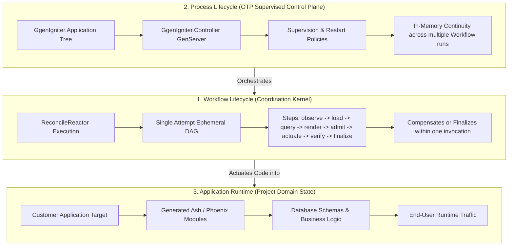

# State Model & Knowledge Projection

> [!NOTE]
> **Core Architectural Principle:** In this documentation suite, **observed implementation outranks intended architecture**.
> Every architectural claim is explicitly labeled with its empirical status: `IMPLEMENTED`, `PARTIAL_ALIVE`, `PLANNED`, `UNSUPPORTED`, or `DEPRECATED`.

This document delineates the distinct lifecycles in `ggen_igniter` and establishes the formal state projection model: $\text{ProjectOwnedState}_t = \text{Projection}(\text{AdmittedKnowledge}_t)$.

---

## 1. The Three Lifecycles

In autonomic software manufacturing, conflating workflow coordination with process supervision or application runtime causes subtle state corruption. `ggen_igniter` strictly separates three lifecycle tiers:

| Lifecycle Tier | Entity / Boundary | State Storage | Reset Trigger |
|---|---|---|---|
| **Workflow Lifecycle** | `ReconcileReactor` instance | Transient Reactor Context | Every reconciliation run |
| **Process Lifecycle** | `GgenIgniter.Controller` | In-process GenServer state | Process crash / Node restart |
| **Application Runtime** | Host Project Source & Database | Disk (`.ex` files), DB tables | Recompile / Migration / Deploy |

---

## 2. Mathematical State Projection Model

$$\text{ProjectOwnedState}_t = \text{Projection}(\text{AdmittedKnowledge}_t)$$

Where:
- $\text{AdmittedKnowledge}_t = \mathcal{G}_t \cap \text{AdmittedRules}(\mathcal{P})$ is the verified knowledge graph content that passes admission invariants at time $t$.
- $\text{Projection}(\cdot)$ is the deterministic mapping defined by SPARQL queries and templates.
- $\text{ProjectOwnedState}_t$ represents the exact set of filesystem artifacts owned by the manufacturing recipe.

### Properties:
1. **Determinism:** Given identical $\text{AdmittedKnowledge}_t$, $\text{Projection}(\text{AdmittedKnowledge}_t)$ produces identical ASTs and byte contents.
2. **Safe Orphaning Elimination:** Any state $S \in \text{ProjectOwnedState}_{t-1} \setminus \text{ProjectOwnedState}_t$ is detected as *stale* and either safely pruned or refused before destructive loss.
3. **Immutability of History:** While $\text{ProjectOwnedState}_t$ reflects only the current projection, the evidence ledger $\mathcal{E}_t$ retains every historical attempt.
