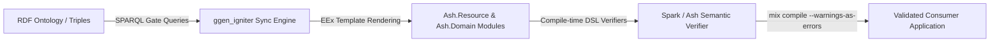

# Ash Integration Overview

**Status: OPTIONAL, consumer-side application model and semantic verifier.**

`ggen_igniter` does not require, bundle, or force Ash onto consuming
applications at runtime. Ash serves as an optional target framework for
generated code and a semantic verifier for domain logic. See section 1 for the
one real qualification: `:ash`/`:ash_postgres` ARE declared in this repo's own
`mix.exs`, scoped `only: [:dev, :test]`.

---

## 1. Core vs. Consumer Dependency Boundary

Observed implementation outranks intended architecture, including over a
previous revision of this page. `mix.exs` **does** declare `:ash` and
`:ash_postgres` — scoped `only: [:dev, :test]`:

```elixir
# mix.exs:176-177 — real, current declarations
{:ash, "~> 3.0", only: [:dev, :test]},
{:ash_postgres, "~> 2.0", only: [:dev, :test]},
```

The claim that survives, and the one that actually matters, is narrower:
**Ash is never a runtime dependency of `ggen_igniter`.** `only: [:dev, :test]`
genuinely keeps both out of a consuming application's runtime; a consumer
declares its own Ash requirement in its own `mix.exs`. `:ash_phoenix` is
genuinely absent — `grep -n ":ash_phoenix" mix.exs` returns zero matches.

The dev/test scoping is deliberate and has a stated reason in the comment
directly above the two declarations, [`mix.exs:167-177`](../../../mix.exs): this
repo's own suite drives the REAL upstream Ash generators through
`Igniter.Test`, the upstream-sanctioned way to test an `Igniter.Mix.Task`
(in-memory project, no subprocess, no scaffolded app). Driving Ash's actual
generators is `ggen_igniter`'s primary use case, so "does our derived argv
really work against them" has to be a real assertion in `mix test`, not only
in a fixture qualification run.

`ggen_igniter` core provides the RDF loading, SPARQL querying, template
evaluation (EEx), write-safety validations, and optional Reactor orchestration
pipeline.

---

## 2. Ash as a Semantic Verifier

When targeting Ash, the generated Elixir files are not mere static data structs. Ash modules (`Ash.Resource`, `Ash.Domain`) validate architectural rules at compile time via Spark DSL extensions.



### Compile-Time Verification Guarantees
1. **Attribute & Type Consistency**: Ensures attribute types correspond to valid Ash types (`:string`, `:atom`, `:uuid`, etc.) and default values match type specifications.
2. **Relationship Integrity**: Verifies that `belongs_to` foreign keys match source attributes and `has_many` associations reference valid destination attributes.
3. **Domain Membership**: Confirms every resource is explicitly admitted and registered to an Ash Domain.
4. **Action Completeness**: Confirms default CRUD actions (`:create`, `:read`, `:update`, `:destroy`) or named custom actions are syntactically and semantically valid.

---

## 3. The `ash-lifecycle-pack` Fixture — superseded pattern, retained for `mix e2e`

**Read this section as history, not as the recommended path.** This pack's
templates HAND-RENDER Ash source — the exact construct `AGENTS.md` now
forbids. Reproduce with
`grep -n "use Ash\." test/fixtures/ash-lifecycle-pack/templates/*.eex`:
`resource.ex.eex` emits `use Ash.Resource,` and `domain.ex.eex` emits
`use Ash.Domain`. The grep is the citation rather than a line number, because
both templates are under active edit. It survives only because
`.claude/hooks/refuse-handwritten-ash.sh` allowlists
`*/test/fixtures/ash-lifecycle-pack/*` past the PreToolUse guard, so the e2e
lifecycle suite below keeps running.

New Ash surfaces use the composed-generator path instead: ontology → 11 SPARQL
gates → ONE composed `Igniter.Mix.Task` → real upstream Ash generators via
`Igniter.compose_task/4`. No template renders Ash resource source on that path.
See `test/fixtures/ash_manufacture_pack/`, `docs/status.md`'s
"Ash manufacturing path" section, and `docs/jira/v26.9.8/07-ASH-MANUFACTURE-PATH.md`.

The pack itself lives under
[`test/fixtures/ash-lifecycle-pack/`](../../../test/fixtures/ash-lifecycle-pack):

| Component | Path | Description |
|---|---|---|
| **Base Ontology** | `ontology.ttl` | Defines `alp:Domain`, `alp:Resource`, `alp:Attribute`, `alp:Action`, `alp:Relationship` for a Support Desk application (`Ticket` and `Customer`). |
| **Delta Ontologies** | `ontology_v2_add_attribute.ttl` ... `v11` | Expresses evolutionary changes (adding attributes, renaming attributes, removing actions, etc.) across the same RDF subject IRIs. |
| **Gate Queries** | `gates/*.rq` | SPARQL queries (`010_resource.rq`, `020_attributes.rq`, `030_actions.rq`, `040_relationships.rq`, `050_domain_resources.rq`, `055_domains.rq`) that project ontology triples into relational row bindings. |
| **Templates** | `templates/*.eex` | EEx templates producing idiomatic `Ash.Resource` (`resource.ex.eex`) and `Ash.Domain` (`domain.ex.eex`) files. |

---

## 4. End-to-End Lifecycle Verification

The full integration lifecycle is demonstrated in [`test/e2e/lifecycle_test.ex`](file:///Users/sac/ggen_igniter/test/e2e/lifecycle_test.ex) and [`test/e2e/support/e2e_case.ex`](file:///Users/sac/ggen_igniter/test/e2e/support/e2e_case.ex):

1. **Stage 0: Scaffold**: Creates a throwaway Phoenix + Igniter + Ash application (`support_desk`) using `mix igniter.new support_desk --install ash,ash_phoenix --with phx.new --with-args="--no-ecto" --yes`.
2. **Stage 1: Initial Sync**: Syncs `resource` and `domain` templates from `ontology.ttl` and compiles clean with zero warnings.
3. **Stage 2: Add Attribute**: Re-syncs against `ontology_v2_add_attribute.ttl` (adding `:priority` to `Ticket`).
4. **Stage 3: Relationships**: Verifies `Ticket belongs_to Customer` (`source_attribute: :customer_id`) and `Customer has_many Tickets` (`destination_attribute: :customer_id`).
5. **Stage 4: Custom Actions**: Verifies named action `:archive` (action type `:update`) on `Ticket`.
6. **Stage 5: Form Integration**: Exercises real `AshPhoenix.Form` `for_create` / `for_update` / `validate` / `submit` round-trip backed by `Ash.DataLayer.Ets`.
7. **Stage 6: LiveView Scaffolding**: Runs `mix ash_phoenix.gen.live` and mounts LiveViews (`TicketLive.Index`, `TicketLive.Form`, `TicketLive.Show`).
8. **Stage 7: Destructive Evolution / Rename**: Re-syncs against `ontology_v3_rename.ttl` (`assignee` -> `assigned_to`). Confirms that the resource regenerates cleanly and statically alerts downstream UI consumers of the breaking field change.

---

## Summary of Integration Rules

- **Zero Runtime Coupling**: `ggen_igniter` never includes `:ash` in its own
  runtime dependencies. It does include `:ash`/`:ash_postgres` under
  `only: [:dev, :test]` (`mix.exs:176-177`) so its own suite can drive the real
  Ash generators — see section 1. "No Ash in `mix.exs` at all" is false.
- **Fail-Closed Verification**: Generated Ash code must satisfy Spark DSL constraints under `mix compile --warnings-as-errors`.
- **Idempotent Regeneration**: By default, `mode: file` re-emits clean, full Ash modules from current ontology state.
