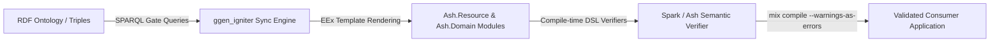

# Ash Integration Overview

**Status: OPTIONAL, consumer-side application model and semantic verifier.**

`ggen_igniter` does not require, bundle, or force Ash onto consuming applications. Instead, Ash serves as an optional target framework for generated code and a semantic verifier for domain logic.

---

## 1. Core vs. Consumer Dependency Boundary

Observed implementation outranks intended architecture: `mix.exs` contains **no** direct dependency on `:ash`, `:ash_phoenix`, or `:ash_postgres`.

### `mix.exs` Core Dependencies

```elixir
defp deps do
  [
    {:rdf, "~> 3.0"},
    {:sparql, "~> 0.3"},
    {:igniter, "~> 0.8"},
    {:reactor, "~> 1.0"},
    {:toml, "~> 0.7"},
    {:yaml_elixir, "~> 2.9"},
    {:rustler, "~> 0.36"},
    {:tesla, "~> 1.8", optional: true},
    {:gno, "~> 0.1", optional: true},
    {:stream_data, "~> 1.2", only: [:dev, :test]},
    {:dialyxir, "~> 1.4", only: [:dev, :test], runtime: false},
    {:credo, "~> 1.7", only: [:dev, :test], runtime: false},
    {:excoveralls, "~> 0.18", only: [:dev, :test]}
  ]
end
```
*(Verified in [`mix.exs`](file:///Users/sac/ggen_igniter/mix.exs#L62-L147))*

`ggen_igniter` core provides the RDF loading, SPARQL querying, template evaluation (EEx), write-safety validations, and optional Reactor orchestration pipeline. Consuming applications install `ash` and related packages in their own `mix.exs`.

---

## 2. Ash as a Semantic Verifier

When targeting Ash, the generated Elixir files are not mere static data structs. Ash modules (`Ash.Resource`, `Ash.Domain`) validate architectural rules at compile time via Spark DSL extensions.



### Compile-Time Verification Guarantees
1. **Attribute & Type Consistency**: Ensures attribute types correspond to valid Ash types (`:string`, `:atom`, `:uuid`, etc.) and default values match type specifications.
2. **Relationship Integrity**: Verifies that `belongs_to` foreign keys match source attributes and `has_many` associations reference valid destination attributes.
3. **Domain Membership**: Confirms every resource is explicitly admitted and registered to an Ash Domain.
4. **Action Completeness**: Confirms default CRUD actions (`:create`, `:read`, `:update`, `:destroy`) or named custom actions are syntactically and semantically valid.

---

## 3. The `ash-lifecycle-pack` Fixture

To verify that `ggen_igniter` correctly generates valid, compilable Ash resources, the repo contains the `ash-lifecycle-pack` fixture pack under [`test/fixtures/ash-lifecycle-pack/`](file:///Users/sac/ggen_igniter/test/fixtures/ash-lifecycle-pack):

| Component | Path | Description |
|---|---|---|
| **Base Ontology** | `ontology.ttl` | Defines `alp:Domain`, `alp:Resource`, `alp:Attribute`, `alp:Action`, `alp:Relationship` for a Support Desk application (`Ticket` and `Customer`). |
| **Delta Ontologies** | `ontology_v2_add_attribute.ttl` ... `v11` | Expresses evolutionary changes (adding attributes, renaming attributes, removing actions, etc.) across the same RDF subject IRIs. |
| **Gate Queries** | `gates/*.rq` | SPARQL queries (`010_resource.rq`, `020_attributes.rq`, `030_actions.rq`, `040_relationships.rq`, `050_domain_resources.rq`, `055_domains.rq`) that project ontology triples into relational row bindings. |
| **Templates** | `templates/*.eex` | EEx templates producing idiomatic `Ash.Resource` (`resource.ex.eex`) and `Ash.Domain` (`domain.ex.eex`) files. |

---

## 4. End-to-End Lifecycle Verification

The full integration lifecycle is demonstrated in [`test/e2e/lifecycle_test.ex`](file:///Users/sac/ggen_igniter/test/e2e/lifecycle_test.ex) and [`test/e2e/support/e2e_case.ex`](file:///Users/sac/ggen_igniter/test/e2e/support/e2e_case.ex):

1. **Stage 0: Scaffold**: Creates a throwaway Phoenix + Igniter + Ash application (`support_desk`) using `mix igniter.new support_desk --install ash,ash_phoenix --with phx.new --with-args="--no-ecto" --yes`.
2. **Stage 1: Initial Sync**: Syncs `resource` and `domain` templates from `ontology.ttl` and compiles clean with zero warnings.
3. **Stage 2: Add Attribute**: Re-syncs against `ontology_v2_add_attribute.ttl` (adding `:priority` to `Ticket`).
4. **Stage 3: Relationships**: Verifies `Ticket belongs_to Customer` (`source_attribute: :customer_id`) and `Customer has_many Tickets` (`destination_attribute: :customer_id`).
5. **Stage 4: Custom Actions**: Verifies named action `:archive` (action type `:update`) on `Ticket`.
6. **Stage 5: Form Integration**: Exercises real `AshPhoenix.Form` `for_create` / `for_update` / `validate` / `submit` round-trip backed by `Ash.DataLayer.Ets`.
7. **Stage 6: LiveView Scaffolding**: Runs `mix ash_phoenix.gen.live` and mounts LiveViews (`TicketLive.Index`, `TicketLive.Form`, `TicketLive.Show`).
8. **Stage 7: Destructive Evolution / Rename**: Re-syncs against `ontology_v3_rename.ttl` (`assignee` -> `assigned_to`). Confirms that the resource regenerates cleanly and statically alerts downstream UI consumers of the breaking field change.

---

## Summary of Integration Rules

- **Zero Core Coupling**: `ggen_igniter` never includes `:ash` in its own runtime dependencies.
- **Fail-Closed Verification**: Generated Ash code must satisfy Spark DSL constraints under `mix compile --warnings-as-errors`.
- **Idempotent Regeneration**: By default, `mode: file` re-emits clean, full Ash modules from current ontology state.
