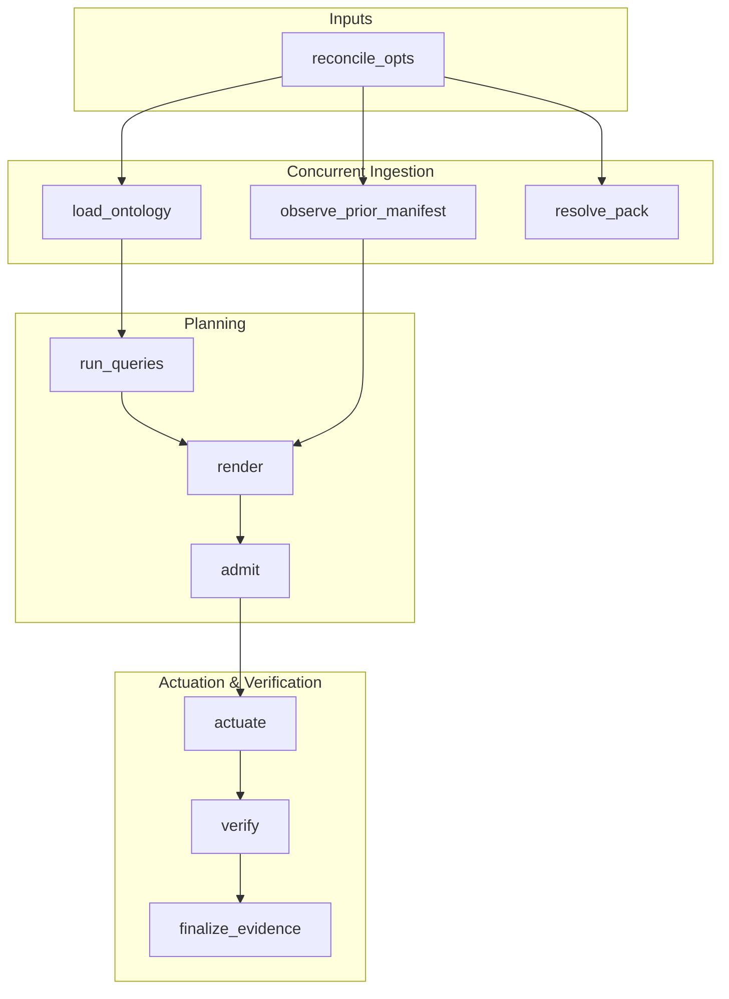

# Ash Reactor vs. ggen_igniter Manufacturing Pipelines

Clarifying the distinction and architectural boundary between the standalone `Reactor` execution kernel used by `ggen_igniter` and consumer-facing `Ash.Reactor` workflows.

---

## 1. Architectural Disambiguation

It is essential to distinguish between the two different uses of "Reactor" in the ecosystem:

| Concept | Package | Usage in `ggen_igniter` | Scope |
|---|---|---|---|
| **Core Workflow Kernel** | `{:reactor, "~> 1.0"}` | Used in `GgenIgniter.Reactors.ReconcileReactor` | Compiles and executes the manufacturing pipeline (observe -> load -> resolve -> query -> render -> admit -> actuate -> verify -> finalize). |
| **Ash Domain Workflow** | `{:ash, ...}` (`Ash.Reactor`) | **Not used** in `ggen_igniter` core | Used inside consumer applications to orchestrate multi-step business transactions across Ash resources. |

`GgenIgniter.Reactors.ReconcileReactor` uses **plain `Reactor`**, explicitly avoiding `Ash.Reactor`:
```elixir
defmodule GgenIgniter.Reactors.ReconcileReactor do
  use Reactor # Plain Reactor, NOT Ash.Reactor
  ...
end
```
*(Verified in [`lib/ggen_igniter/reactors/reconcile_reactor.ex`](file:///Users/sac/ggen_igniter/lib/ggen_igniter/reactors/reconcile_reactor.ex#L260))*

This ensures `ggen_igniter` maintains zero mandatory dependencies on Ash.

---

## 2. The `ReconcileReactor` Pipeline

`GgenIgniter.Reactors.ReconcileReactor` structures the ontology reconciliation spine into a step-based DAG:



---

## 3. Compensation & Reversal Semantics

One of the primary benefits of using `Reactor` for `ggen_igniter` reconciliation is transactional safety with deterministic compensation:

1. **Step Failure Rollback (`undo/4`)**:
   - If `:verify` fails (e.g. `mix compile --warnings-as-errors` fails due to syntax or DSL errors), Reactor invokes the `undo/4` handler of `:actuate`.
   - All written or modified files are reverted to their pre-run states.
2. **Evidence Recording**:
   - `finalize_evidence` guarantees that execution receipts (`GgenIgniter.Receipt`) are persisted to `.ggen_igniter/receipts/` with standing `:build_broken` or `:compensated`.
   - The manifest is only promoted if `:verify` passes and the receipt is durably recorded.

---

## 4. Relationship to Consumer Ash.Reactor Pipelines

Consuming applications may use `Ash.Reactor` to define business logic workflows. For example, a customer onboarding workflow might orchestrate calls across generated `Customer` and `Ticket` resources:

```elixir
defmodule SupportDesk.Workflows.OnboardCustomer do
  use Ash.Reactor

  ash do
    default_domain SupportDesk.Support
  end

  create :create_customer, SupportDesk.Support.Customer do
    inputs %{
      name: input(:name),
      email: input(:email)
    }
  end

  create :create_welcome_ticket, SupportDesk.Support.Ticket do
    inputs %{
      subject: "Welcome to SupportDesk",
      status: :open,
      customer_id: result(:create_customer, [:id])
    }
  end
end
```

In this architecture:
- `ggen_igniter`'s `ReconcileReactor` manufactures and maintains the underlying `Customer` and `Ticket` resource definitions.
- The consumer application's `Ash.Reactor` workflows consume and orchestrate those resources at runtime.
