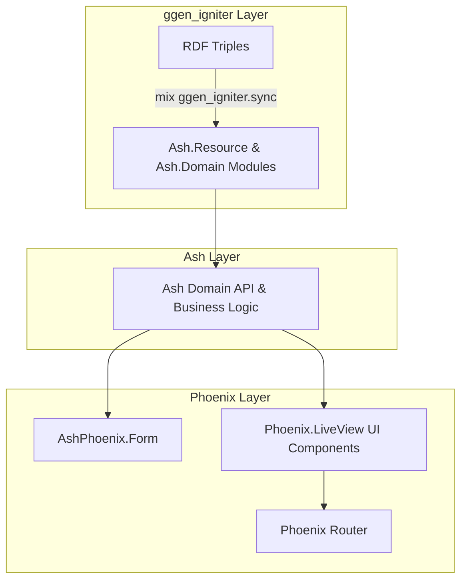

# Phoenix Integration Overview

**Status: OPTIONAL, consumer-side web framework integration.**

Phoenix is an optional web presentation layer for applications consuming `ggen_igniter`-manufactured resources. `ggen_igniter` core does not depend on Phoenix or Phoenix LiveView.

---

## 1. Core vs. Consumer Boundary

`mix.exs` of `ggen_igniter` contains no dependency on `:phoenix`, `:phoenix_live_view`, or `:phoenix_html`.

`ggen_igniter` does not generate Phoenix controllers, views, or endpoints directly. Instead, `ggen_igniter` generates clean, valid Ash resources and domains, which are then exposed to the web layer through Phoenix and `ash_phoenix`.

---

## 2. Integration Architecture



---

## 3. Scaffolding Phoenix Consumer Applications

In end-to-end testing ([`test/e2e/support/e2e_case.ex`](file:///Users/sac/ggen_igniter/test/e2e/support/e2e_case.ex#L159-L265)), a consumer application is scaffolded using:

```bash
mix igniter.new support_desk \
  --install ash,ash_phoenix \
  --with phx.new \
  --with-args="--no-ecto" \
  --yes
```

### Why `--no-ecto` is Used
By default, `phx.new` scaffolds an Ecto Postgres repo and sandbox configurations (`DataCase`, `ConnCase`). Passing `--with-args="--no-ecto"` prevents generating unnecessary Postgres boilerplate when resources use in-memory data layers such as `Ash.DataLayer.Ets`.

---

## 4. AshPhoenix.Form Integration (Stage 5)

`AshPhoenix.Form` provides form helpers that bind directly to Ash resource actions without requiring Ecto changeset scaffolding.

```elixir
# Creating a record via AshPhoenix.Form
form = AshPhoenix.Form.for_create(SupportDesk.Support.Ticket, :create, domain: SupportDesk.Support)
form = AshPhoenix.Form.validate(form, %{"subject" => "Network outage", "status" => "open"})
{:ok, ticket} = AshPhoenix.Form.submit(form)

# Updating a record
update_form = AshPhoenix.Form.for_update(ticket, :update, domain: SupportDesk.Support)
update_form = AshPhoenix.Form.validate(update_form, %{"subject" => "Network outage resolved"})
{:ok, updated_ticket} = AshPhoenix.Form.submit(update_form)
```
*(Exercised in [`test/e2e/lifecycle_test.ex`](file:///Users/sac/ggen_igniter/test/e2e/lifecycle_test.ex#L485-L541))*
