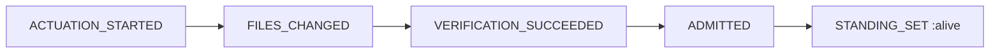
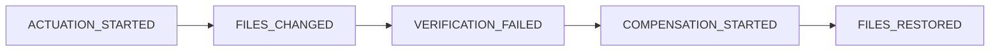

# Object-Centric Event Log (OCEL 2.0)

Status: **IMPLEMENTED (as an OCEL-shaped event log)**. Verified against `lib/ggen_igniter/telemetry/ocel_emitter.ex`, `lib/ggen_igniter/reactors/reconcile_reactor.ex`, and test suite `test/ggen_igniter_ocel_emitter_test.exs`.

---

## 1. Overview & Standard Alignment

[OCEL 2.0 (Object-Centric Event Log)](https://www.ocel-standard.org/) provides a standardized exchange format for event logs that capture interactions across multiple concurrent objects.

`ggen_igniter` implements an **OCEL 2.0-shaped JSON event stream** via `GgenIgniter.Telemetry.OcelEmitter`. This event structure powers process observability, receipts, and failure compensation auditing.

### Observed Implementation vs. Full OCEL 2.0 Standard

- **Implemented**: Structured JSON event objects containing `id`, `activity`, `time`, `objects` list (with `type` and `id`), and custom `attributes`.
- **Deliberate Scoping (Partial)**: The implementation does not maintain separate formal object-type registries, XML-OCEL serializers, or SQLite relational schema exporters. Events and object references are embedded directly in receipt JSONL lines.

---

## 2. Schema Mappings: JSON-OCEL, XML-OCEL, and SQLite

In the OCEL 2.0 specification, event logs can be represented in JSON, XML, or Relational (SQLite) formats. Below is the mapping between `ggen_igniter`'s implemented JSON structure and the standard representations:

### A. JSON-OCEL Representation (Implemented)

```json
{
  "id": "ev_7a8b9c0d1e2f3a4b",
  "activity": "ACTUATION_STARTED",
  "time": "2026-08-27T16:51:29.010000Z",
  "objects": [
    {
      "type": "file",
      "id": "lib/support_desk/support/ticket.ex"
    },
    {
      "type": "reconcile_run",
      "id": "run_01j6k8m9n0p1q2r3"
    }
  ],
  "attributes": {
    "paths": ["lib/support_desk/support/ticket.ex"],
    "pre_run_hash": "sha256:36666c437cf2be158e6544305f9d3f716b8d419fe6783caafba40dc4f8a1600b"
  }
}
```

### B. Relational / SQLite Schema Mapping

In an OCEL 2.0 relational database schema (e.g., SQLite), `ggen_igniter` events map to the core standard tables:

```sql
-- 1. Events Table
CREATE TABLE ocel_event (
    ocel_id VARCHAR PRIMARY KEY,         -- e.g. 'ev_7a8b9c0d1e2f3a4b'
    ocel_type VARCHAR NOT NULL,          -- e.g. 'ACTUATION_STARTED'
    ocel_time TIMESTAMP NOT NULL         -- e.g. '2026-08-27 16:51:29.010000'
);

-- 2. Objects Table
CREATE TABLE ocel_object (
    ocel_id VARCHAR PRIMARY KEY,         -- e.g. 'lib/support_desk/support/ticket.ex'
    ocel_type VARCHAR NOT NULL           -- e.g. 'file', 'ontology', 'pack', 'template'
);

-- 3. Event-to-Object Relations (E2O)
CREATE TABLE ocel_event_object (
    ocel_event_id VARCHAR REFERENCES ocel_event(ocel_id),
    ocel_object_id VARCHAR REFERENCES ocel_object(ocel_id),
    ocel_qualifier VARCHAR,              -- e.g. 'target', 'source', 'context'
    PRIMARY KEY (ocel_event_id, ocel_object_id)
);

-- 4. Event Attributes (E2A)
CREATE TABLE ocel_event_attribute (
    ocel_event_id VARCHAR REFERENCES ocel_event(ocel_id),
    ocel_name VARCHAR NOT NULL,          -- e.g. 'pre_run_hash', 'reason_type'
    ocel_val_str VARCHAR,
    ocel_val_time TIMESTAMP,
    ocel_val_num DOUBLE PRECISION
);
```

### C. XML-OCEL Mapping

In standard XML-OCEL syntax:
```xml
<log>
  <events>
    <event id="ev_7a8b9c0d1e2f3a4b" type="ACTUATION_STARTED" time="2026-08-27T16:51:29.010000Z">
      <objects>
        <object id="lib/support_desk/support/ticket.ex" type="file"/>
      </objects>
      <attributes>
        <string name="paths">lib/support_desk/support/ticket.ex</string>
      </attributes>
    </event>
  </events>
</log>
```

---

## 3. Objects Taxonomy

`OcelEmitter` provides constructors for object references ([`ocel_emitter.ex:161-167`](file:///Users/sac/ggen_igniter/lib/ggen_igniter/telemetry/ocel_emitter.ex#L161-L167)):

| Object Type | Constructor | Target Identity (`id`) | Role in Pipeline |
|---|---|---|---|
| **`"file"`** | `OcelEmitter.file_object(path)` | Relative file path (e.g., `"lib/user.ex"`). | Represents the physical or logical file artifact being created, modified, or restored. |
| **`"reconcile_run"`** | `OcelEmitter.run_object(run_id)` | Unique reconciliation attempt ID. | Represents the execution container coordinating the reconciliation. |
| **`"ontology"`** | *Conceptual extension* | Ontology path or URI (`"priv/ontology.ttl"`). | The semantic graph source driving queries. |
| **`"pack"`** | *Conceptual extension* | Pack name / directory (`"ash-lifecycle-pack"`). | The bundled template and gate asset package. |
| **`"template"`** | *Conceptual extension* | Template path (`"templates/resource.ex.eex"`). | The code generator template source. |

---

## 4. Activities & Lifecycle Event Sequences

The reconciliation pipeline emits specific activity tokens based on execution flow:

### A. The Happy Path
When all steps succeed and files are verified:



1. **`ACTUATION_STARTED`**: Emitted by `:actuate` (`run/3`) before writing files.
   - `attributes`: `%{"paths" => [...]}`
2. **`FILES_CHANGED`**: Emitted by `:actuate` (`run/3`) after files have been written.
   - `attributes`: `%{"paths" => [...]}`
3. **`VERIFICATION_SUCCEEDED`**: Emitted by `:verify` when `mix compile --warnings-as-errors` exits `0`.
4. **`ADMITTED`**: Emitted by `:finalize_evidence` before persisting receipt.
   - `attributes`: `%{"paths" => [...]}`
5. **`STANDING_SET`**: Emitted by `:finalize_evidence` after receipt and manifest are persisted.
   - `attributes`: `%{"standing" => "alive", "manifest_promotion" => "..."}`

---

### B. The Compensated / Broken Path
When actuation occurs but `:verify` or downstream steps fail:



1. **`ACTUATION_STARTED`**: Emitted before writes occur.
2. **`FILES_CHANGED`**: Emitted after files hit disk.
3. **`VERIFICATION_FAILED`**: Emitted when compilation or verification fails.
   - `attributes`: `%{"reason_type" => "build_broken", "message" => "..."}`
4. **`COMPENSATION_STARTED`**: Emitted by `:actuate` (`undo/3`) as rollback commences.
5. **`FILES_RESTORED`**: Emitted by `:actuate` (`undo/3`) after prior file contents are restored.
   - `attributes`:
     ```json
     {
       "paths": ["lib/support/ticket.ex"],
       "pre_run_hash": "sha256:...",
       "post_run_hash": "sha256:...",
       "matches_pre_run_hash": true
     }
     ```

---

### C. The Refusal Path
When admission checks halt execution before any disk actuation:

1. **`GUARD_REFUSED`**: Emitted by `:admit` when collisions, unowned deletions, or stale outputs trigger fail-closed behavior.
   - `objects`: `[]`
   - `attributes`: `%{"reason" => "..."}`
   - `ACTUATION_STARTED` is never emitted.

---

## 5. Verification & Test Evidence

Tested in [`test/ggen_igniter_ocel_emitter_test.exs`](file:///Users/sac/ggen_igniter/test/ggen_igniter_ocel_emitter_test.exs) and [`test/ggen_igniter_reconcile_reactor_test.exs`](file:///Users/sac/ggen_igniter/test/ggen_igniter_reconcile_reactor_test.exs):

```elixir
# Asserting complete compensated OCEL activity trace
activities = Enum.map(receipt.events, & &1["activity"])
assert "ACTUATION_STARTED" in activities
assert "FILES_CHANGED" in activities
assert "VERIFICATION_FAILED" in activities
assert "COMPENSATION_STARTED" in activities
assert "FILES_RESTORED" in activities

# Asserting refusal emits no actuation
refute Enum.any?(refused_receipt.events, &(&1["activity"] == "ACTUATION_STARTED"))
```
