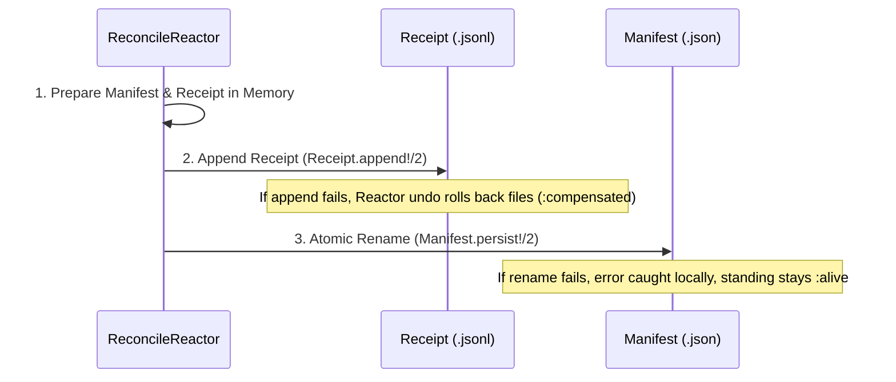

# State Reconstruction, Compensation & Evidence Recovery

Status: **IMPLEMENTED**. Verified against `lib/ggen_igniter/reactors/reconcile_reactor.ex`, `lib/ggen_igniter/receipt.ex`, and test suites (`test/ggen_igniter_reconcile_reactor_test.exs`, `test/ggen_igniter_finalize_evidence_ordering_test.exs`).

---

## 1. Overview

`ggen_igniter` ensures state auditability and deterministic recovery through three interconnected mechanisms:
1. **Durable Event & Receipt Logs**: Chronological history stored in date-partitioned JSONL logs.
2. **Deterministic Reactor Compensation / Undo**: Exact rollback of actuated disk files when downstream verification fails.
3. **Evidence-First Finalization**: Strict write ordering ensuring that process receipts are durable before manifest promotion occurs.

---

## 2. Reactor Rollback Semantics: `compensate/4` vs. `undo/3`

Reactor provides distinct lifecycle callbacks for error handling:

- **`compensate/4` (Step-Internal Recovery)**:
  - Triggered when a step's *own* `run/3` returns `{:error, reason}`.
  - In `:actuate`, `run/3` performs self-healing directly: if any file write fails mid-batch in `Task.async_stream`, `actuate_pending/2` reverts all previously-written files from that same batch *before* returning `{:error, ...}` ([`reconcile_reactor.ex:917-948`](file:///Users/sac/ggen_igniter/lib/ggen_igniter/reactors/reconcile_reactor.ex#L917-L948)).
  - As a result, `:actuate`'s `compensate/4` has nothing left to revert and cleanly returns `:ok`.
- **`undo/3` (Downstream Step Rollback)**:
  - Triggered when a *downstream* step (such as `:verify`) fails after `:actuate` has already succeeded.
  - `:actuate`'s `undo/3` callback ([`reconcile_reactor.ex:355-376`](file:///Users/sac/ggen_igniter/lib/ggen_igniter/reactors/reconcile_reactor.ex#L355-L376)) reads the `tracked` map, emits `"COMPENSATION_STARTED"`, calls `revert_all/1`, and verifies file restoration by emitting `"FILES_RESTORED"` with matching pre/post hashes.

### Reversion Mechanism (`revert_all/1`)

During actuation, each file modification records its prior state:
- `{:existed, prior_bytes}`: The original file content before overwrite.
- `:new`: The file did not exist prior to this run.

Rollback executes:
```elixir
defp revert_one(path, {:existed, prior_content}), do: File.write!(path, prior_content)
defp revert_one(path, :new), do: File.rm(path)
```

---

## 3. Hash Integrity & Restoration Verification

Integrity is cryptographically verified using SHA-256 digests over sorted file entries:

1. **Pre-Run Hash (`pre_run_hash`)**:
   Calculated from in-memory tracked prior entries via `Receipt.hash_entries/1`.
2. **Post-Run Hash (`post_run_hash`)**:
   Calculated by physically reading the restored files from disk via `Receipt.hash_files/1`.

On `:compensated` and `:build_broken` outcomes:
$$\text{pre\_run\_hash} == \text{post\_run\_hash}$$
This equality proves that disk state has been restored bit-for-bit to its exact pre-run image.

---

## 4. Evidence-First Finalization Protocol

To eliminate the split-brain hazard where a manifest advances but receipt evidence is lost, `:finalize_evidence` enforces strict write ordering:



### Manifest-Promotion Failure Recovery

If `Manifest.persist!/2` fails (e.g., read-only parent directory or disk permissions error):
- The physical files have already been verified and remain intact.
- The failure is caught locally and recorded in `receipt.metadata["manifest_promotion"] = "{:pending, ...}"`.
- The receipt remains `:alive` and serves as the durable recovery anchor.
- On subsequent runs, diagnostic or recovery tools inspect `.ggen_igniter/receipts/` to reconstruct the manifest without re-actuating files.

---

## 5. Replaying & Reconstructing History from Receipts

Reconstruction of execution history is performed via `GgenIgniter.Receipt.read_all!/1`:

```elixir
# Read all historical attempts in chronological order across all date partitions
receipts = GgenIgniter.Receipt.read_all!(project_dir)

Enum.each(receipts, fn rcpt ->
  IO.puts("[#{rcpt["started_at"]}] Attempt #{rcpt["id"]} -> Standing: #{rcpt["standing"]}")
  IO.puts("  Files: #{Enum.join(rcpt["files"], ", ")}")
  if rcpt["reason"], do: IO.puts("  Failure Reason: #{rcpt["reason"]}")
end)
```

### Reconstructing Manifest from Receipts
If `manifest.json` is lost or corrupted, the latest verified state can be recovered by:
1. Scanning all receipts for `standing == "alive"`.
2. Grouping by `recipe_key`.
3. Extracting the latest file output list and hashes.
4. Writing a restored `%GgenIgniter.Manifest{}`.

---

## 6. Verification & Test Evidence

Tested in [`test/ggen_igniter_reconcile_reactor_test.exs`](file:///Users/sac/ggen_igniter/test/ggen_igniter_reconcile_reactor_test.exs) and [`test/ggen_igniter_finalize_evidence_ordering_test.exs`](file:///Users/sac/ggen_igniter/test/ggen_igniter_finalize_evidence_ordering_test.exs):

```elixir
# Proof of bit-exact restoration under real compilation failure:
assert File.read!(existing_path) == original_content
refute File.exists?(new_path)
refute File.exists?(Manifest.path(project_dir))
assert receipt.standing == :build_broken
assert receipt.pre_run_hash == receipt.post_run_hash

# Proof of evidence-first ordering under manifest write failure:
assert {:ok, receipt} = result
assert receipt.standing == :alive
assert File.exists?(out_path)
refute File.exists?(manifest_path)
assert receipt.metadata["manifest_promotion"] =~ "pending"
assert [persisted] = Receipt.read_all!(project_dir)
assert persisted["standing"] == "alive"
```
