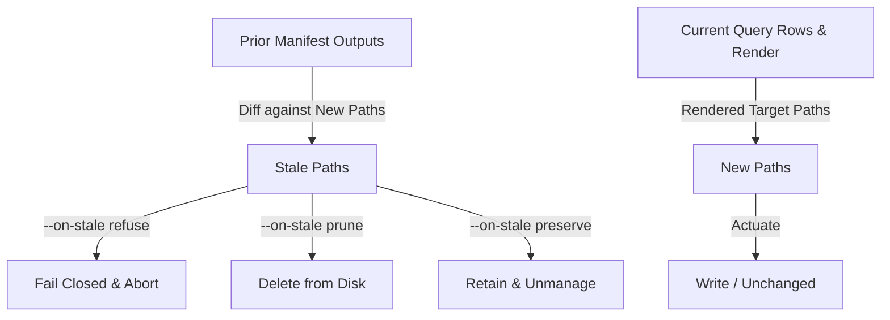

# Destructive Evolution Handling

Destructive evolution occurs when domain models change in ways that remove or rename existing artifacts (e.g. deleting an entity, renaming a resource, removing attributes, altering relationships, or changing domain namespaces). In a stateless generator, this leaves behind orphaned files, dangling references, and broken builds.

`ggen_igniter` addresses destructive evolution via **manufacturing ownership memory** (`GgenIgniter.Manifest`) and a unified reconciliation pipeline.

---

## 1. Ownership Vocabulary

The reconciliation architecture establishes formal classifications for files across sync iterations:



### Path-Set Vocabulary (Default CLI Pipeline)

| Concept | Definition | Implementation Source |
|---|---|---|
| **Prior Ownership** | Paths recorded in manifest entry from the preceding run. | `Manifest.output_paths(old_entry)` |
| **Desired Ownership** | Paths rendered from the current ontology state. | `new_paths` |
| **Stale Artifacts** | Paths previously owned but omitted in current generation ($\text{Prior} \setminus \text{Desired}$). | `Manifest.stale_paths(old_entry, new_paths)` |
| **Unowned Files** | Files on disk not tracked by this recipe. Ignored during reconciliation. | Files outside `output_paths` |

### Intermediate Representation Vocabulary (`GgenIgniter.PendingActuation`)

In the opt-in `ReconcileReactor`, planned operations are captured in `%PendingActuation{}` structs prior to execution:

- `operation`: `:create` \| `:replace` \| `:inject` \| `:delete` \| `:eval`
- `ownership`: `boolean` (asserts whether path was previously owned in manifest)
- `previous_hash`: SHA-256 hash of existing disk file (`nil` if absent)
- `desired_hash`: SHA-256 hash of rendered output (`nil` for `:delete`)
- `plan_unchanged?`: `true` if `previous_hash == desired_hash`

---

## 2. Nine Destructive Evolution Shapes

The test suite (`test/ggen_igniter_destructive_change_agent3_test.exs`) proves zero orphaned references and clean reconciliation across 9 destructive ontology evolution patterns against the `ash-lifecycle-pack` fixture:

| # | Destructive Pattern | Fixture / Variant | Expected Behavior & Assertions |
|---|---|---|---|
| 1 | **Rename Attribute** | `ontology_v3_rename.ttl` (`assignee` $\to$ `assigned_to`) | `ticket.ex` removes `assignee`, adds `attribute :assigned_to, :string`. Siblings (`priority`, `archive`) preserved. File path unchanged; `--on-stale` not triggered. |
| 2 | **Remove Attribute** | `ontology_v4_remove_attribute.ttl` | `assignee` removed from `ticket.ex`. Siblings preserved. |
| 3 | **Rename Action** | `ontology_v5_rename_action.ttl` (`:archive` $\to$ `:close`) | `archive` removed, `update :close do` generated in `ticket.ex`. |
| 4 | **Remove Action** | `ontology_v6_remove_action.ttl` | `:archive` removed. Default CRUD actions survive. |
| 5 | **Rename Relationship** | `ontology_v7_rename_relationship.ttl` (`:customer` $\to$ `:client`) | `belongs_to :customer` removed, `belongs_to :client, SupportDesk.Support.Customer` generated with `source_attribute(:customer_id)`. |
| 6 | **Remove Relationship** | `ontology_v8_remove_relationship.ttl` | `belongs_to :customer` removed. Ticket attributes and actions survive. |
| 7 | **Rename Resource** | `ontology_v9_rename_resource.ttl` (`Ticket` $\to$ `Case`) | With `--on-stale prune`: generates `case.ex`, deletes `ticket.ex` (`refute File.exists?(ticket_path)`), drops `ticket.ex` from manifest. |
| 8 | **Remove Resource** | `ontology_v10_remove_resource.ttl` | With `--on-stale prune`: `customer.ex` re-renders with empty relationships block, `ticket.ex` is pruned from disk and manifest. |
| 9a | **Change Domain Association (Resource)** | `ontology_v11_change_domain_association.ttl` | `ticket.ex` domain updated from `SupportDesk.Support` to `SupportDesk.Billing`. 0 stale references to old domain. |
| 9b | **Change Domain Association (Domain Fan-out)** | `ontology_v11_change_domain_association.ttl` | `domain.ex.eex` fans out per domain: `billing.ex` and `support.ex` each register only their respective resources. |

---

## 3. Safe Schema Migration & Build Preservation

### Atomic Pruning & Compilation Gate

To prevent build breakage during destructive evolution:
1. **Refuse Default:** By default (`--on-stale refuse`), the generator refuses to apply destructive renames without explicit operator confirmation, preventing unintentional code loss.
2. **Reactor Verification Gate:** In `ReconcileReactor`, stale deletions occur in `:finalize_evidence` only **after** the `:verify` step successfully runs `mix compile --warnings-as-errors`. If the new code fails compilation, the prior files are preserved and the run fails safely.
3. **Execution Receipts:** Reconcile operations record execution receipts with deterministic standings:
   - `:alive`: Complete success across generation, compilation, and pruning.
   - `:refused`: Refused prior to actuation (e.g. stale refuse).
   - `:build_broken`: Actuation completed but compilation check failed.
   - `:compensated`: Post-actuation error encountered and changes were rolled back.

---

## 4. Verification & Test Evidence

All 9 destructive change scenarios are verified by automated tests:

```bash
mix test test/ggen_igniter_destructive_change_agent3_test.exs
# 10 tests, 0 failures (2026-08-27)
```
