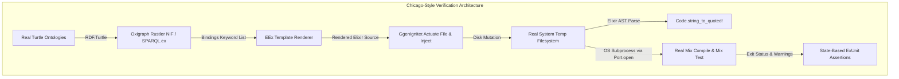

# Chicago-School Testing Discipline

This project strictly follows the Chicago-school (classicist) testing discipline: **real collaborators, real state-based assertions, real filesystem writes, real compilation, and zero mock-library test doubles** for code this codebase owns or that can be run locally.

Status: **IMPLEMENTED**. Mechanically verified against HEAD.

---

## 1. Zero Mocking Policy

A strict grep across `test/`, `lib/`, and `native/` confirms zero mock-library usage:

```bash
$ grep -rn "Mock\|mock(\|patch(\|monkeypatch" test lib native
$ echo $?
1
```

Exit code `1` confirms that neither `Mox`, `unittest.mock`, `Mock`, nor runtime monkeypatching is present anywhere in this repository.

### Philosophy: Classicist vs. Mockist
- **Mockist (London School)**: Verifies interactions, protocol messages, and method call counts on synthetic doubles. Disadvantage: tests pass while real systems fail due to mismatched collaborator assumptions (e.g., subtle quoting discrepancies, unexpected CLI prompts, or type mismatch errors).
- **Classicist (Chicago School)**: Tests execute against real dependencies with state-based assertions verifying observable outputs, on-disk artifacts, AST quotations, and subprocess exit codes.

---

## 2. Real Collaborators in Action

Every test suite in `test/` operates with real underlying engines, parsers, and subprocesses:

| Collaborator | Implementation Used | Test Reference |
|---|---|---|
| **SPARQL Engine** | `sparql` 0.3.12 Hex package executing SPARQL 1.1 algebra | [`GgenIgniter.Query`](file:///Users/sac/ggen_igniter/lib/ggen_igniter/query.ex), [`test/ggen_igniter_sync_properties_test.exs`](file:///Users/sac/ggen_igniter/test/ggen_igniter_sync_properties_test.exs) |
| **Oxigraph Engine** | Native Rustler NIF ([`native/ggen_graph_nif`](file:///Users/sac/ggen_igniter/native/ggen_graph_nif)) wrapping Oxigraph RDF store | [`GgenIgniter.Engine.Oxigraph`](file:///Users/sac/ggen_igniter/lib/ggen_igniter/engine.ex), [`test/ggen_igniter_cross_engine_equivalence_properties_test.exs`](file:///Users/sac/ggen_igniter/test/ggen_igniter_cross_engine_equivalence_properties_test.exs) |
| **RDF Parser** | Real `RDF.Turtle.read_file!/1` and `RDF.Graph` | [`GgenIgniter.Ontology`](file:///Users/sac/ggen_igniter/lib/ggen_igniter/ontology.ex), [`test/ash_r2rml_gate_integration_test.exs`](file:///Users/sac/ggen_igniter/test/ash_r2rml_gate_integration_test.exs) |
| **Template Engine** | Real `EEx.eval_string/2` with YAML frontmatter parsing | [`GgenIgniter.Render`](file:///Users/sac/ggen_igniter/lib/ggen_igniter/render.ex), [`test/ggen_igniter_render_properties_test.exs`](file:///Users/sac/ggen_igniter/test/ggen_igniter_render_properties_test.exs) |
| **Filesystem Actuation** | Real `File.write!/2`, `File.read!/1`, `File.rm_rf!/1`, `File.rename!/2` | [`GgenIgniter.Actuate`](file:///Users/sac/ggen_igniter/lib/ggen_igniter/actuate.ex), [`test/actuate_test.exs`](file:///Users/sac/ggen_igniter/test/actuate_test.exs), [`test/actuate_inject_test.exs`](file:///Users/sac/ggen_igniter/test/actuate_inject_test.exs) |
| **Subprocess Execution** | Real OS ports ([`Port.open/2`](file:///Users/sac/ggen_igniter/test/e2e/support/e2e_case.ex#L98-L105)) running `mix compile`, `mix test`, `mix igniter.new` | [`GgenIgniter.E2e.Case.cmd!/3`](file:///Users/sac/ggen_igniter/test/e2e/support/e2e_case.ex#L89-L127), [`test/e2e/lifecycle_test.ex`](file:///Users/sac/ggen_igniter/test/e2e/lifecycle_test.ex) |
| **Compiler & Runtime** | Real `mix compile --warnings-as-errors`, `Code.string_to_quoted!/1`, `Ash.DataLayer.Ets` | [`test/e2e/lifecycle_test.ex`](file:///Users/sac/ggen_igniter/test/e2e/lifecycle_test.ex), [`test/ggen_igniter_reconcile_reactor_test.exs`](file:///Users/sac/ggen_igniter/test/ggen_igniter_reconcile_reactor_test.exs) |

---

## 3. Disclosed Exceptions: Visible Skips vs. Fakes

In Chicago-style testing, external services that cannot be run hermetically or that require external network daemons are **never mocked**. Instead, they degrade to a **named, visible ExUnit tag exclusion**:

1. **QLever Remote SPARQL Server**:
   - Test: [`test/ash_r2rml_gate_qlever_test.exs`](file:///Users/sac/ggen_igniter/test/ash_r2rml_gate_qlever_test.exs)
   - ExUnit tag: `@tag :requires_qlever_server`
   - Behavior: Excluded by default via `ExUnit.configure(exclude: [:requires_qlever_server])`. Runs only when a live QLever server (`http://localhost:7020`) is available.
2. **External Sibling Repositories (`~/ash_r2rml`)**:
   - Test: [`test/ash_r2rml_gate_integration_test.exs`](file:///Users/sac/ggen_igniter/test/ash_r2rml_gate_integration_test.exs)
   - ExUnit tag: `@tag :requires_ash_r2rml`
   - Behavior: Automatically skipped with a visible notification if `~/ash_r2rml` is not present on disk.

---

## 4. Property-Based Testing with StreamData

Rather than relying purely on hand-crafted static examples, the test suite leverages `StreamData` and `ExUnitProperties` across 8 property suites:

- [`test/ggen_igniter_actuate_properties_test.exs`](file:///Users/sac/ggen_igniter/test/ggen_igniter_actuate_properties_test.exs): Mathematical idempotency ($\mu(\mu(O)) = \mu(O)$), `unless_exists` short-circuiting, `skip_if` precedence over byte comparisons, and dry-run filesystem purity.
- [`test/ggen_igniter_actuation_dispatch_matrix_properties_test.exs`](file:///Users/sac/ggen_igniter/test/ggen_igniter_actuation_dispatch_matrix_properties_test.exs): Combinatorial exploration of the 6-dimensional execution space:
  $$\text{Engine} \times \text{Mode} \times \text{For-Each} \times \text{Dry-Run} \times \text{Inject} \times \text{GuardVariant}$$
- [`test/ggen_igniter_sync_properties_test.exs`](file:///Users/sac/ggen_igniter/test/ggen_igniter_sync_properties_test.exs): Pure binding resolution, query collision preservation, and override order.
- [`test/ggen_igniter_cross_engine_equivalence_properties_test.exs`](file:///Users/sac/ggen_igniter/test/ggen_igniter_cross_engine_equivalence_properties_test.exs): Verifies result equivalence between native `oxigraph` and Hex `sparql` engines across randomly generated RDF triples and SPARQL SELECT queries.
- [`test/ggen_igniter_frontmatter_properties_test.exs`](file:///Users/sac/ggen_igniter/test/ggen_igniter_frontmatter_properties_test.exs): Frontmatter parsing, serialization, and round-tripping.
- [`test/ggen_igniter_full_pipeline_properties_test.exs`](file:///Users/sac/ggen_igniter/test/ggen_igniter_full_pipeline_properties_test.exs): Full end-to-end in-process pipeline: frontmatter extraction $\to$ template render $\to$ disk actuation.
- [`test/ggen_igniter_pack_properties_test.exs`](file:///Users/sac/ggen_igniter/test/ggen_igniter_pack_properties_test.exs): Pack resolution, template discovery, and named gate discovery.
- [`test/ggen_igniter_render_properties_test.exs`](file:///Users/sac/ggen_igniter/test/ggen_igniter_render_properties_test.exs): EEx evaluation safety and frontmatter splitting.

---

## 5. Summary Matrix of Real Collaborators



By subjecting every change to real file writes, real compiler verification, and real RDF/SPARQL engines, `ggen_igniter` ensures that green tests translate directly to reliable production execution.
