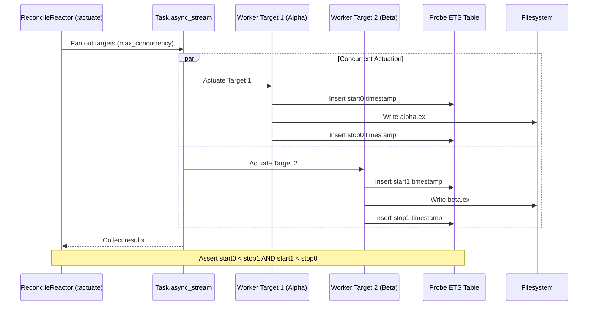

# Concurrency & Parallel Execution Safety

Concurrent testing in `ggen_igniter` spans three levels:
1. **Property-based generation** using `StreamData` across combinatorial dimensions.
2. **Asynchronous test execution** using `ExUnit.Case, async: true` with strict filesystem isolation.
3. **Parallel task safety** in `GgenIgniter.Reactors.ReconcileReactor` using `Task.async_stream/3`.

Status: **IMPLEMENTED**. Verified with timing assertions and collision guards.

---

## 1. StreamData Property Testing

The test suite uses `StreamData` to stress test invariants against randomized input spaces:

### Actuation Dispatch Matrix ([`test/ggen_igniter_actuation_dispatch_matrix_properties_test.exs`](file:///Users/sac/ggen_igniter/test/ggen_igniter_actuation_dispatch_matrix_properties_test.exs))
Generates members of the 40 valid combinations in the 6-dimensional matrix:
- **Engines**: `"sparql"`, `"oxigraph"`
- **Modes**: `:file`, `:eval`
- **Execution Flags**: `for_each: boolean()`, `dry_run: boolean()`
- **Mutation Rules**: `inject: boolean()` (for `mode: file`), `guard_variant: :none | :unless_exists | :skip_if` (for `inject: false`)

Each generated case writes temporary fixtures to a dedicated directory and invokes `mix ggen_igniter.sync` to assert that the correct on-disk, skipped, or evaluated branch executes.

### Pure Sync Binding Properties ([`test/ggen_igniter_sync_properties_test.exs`](file:///Users/sac/ggen_igniter/test/ggen_igniter_sync_properties_test.exs))
Exercises pure functions `build_bindings/2` and `resolve_named_queries!/2`:
- Validates that named query row lists are preserved without truncation.
- Proves that `--for-each` row variables take precedence over single-row query flattened variables on key collision.
- Confirms that explicit `--query` CLI arguments override same-named frontmatter inline queries.

---

## 2. ExUnit Async Isolation Discipline

Tests specify `async: true` whenever possible to maximize test execution throughput across multi-core BEAM schedulers.

### Rules for `async: true` Safety
1. **Unique Per-Test Temp Dirs**:
   ```elixir
   setup do
     tmp_dir =
       Path.join(
         System.tmp_dir!(),
         "test_module_#{System.unique_integer([:positive])}"
       )
     File.mkdir_p!(tmp_dir)
     on_exit(fn -> File.rm_rf!(tmp_dir) end)
     {:ok, tmp_dir: tmp_dir}
   end
   ```
2. **OS Process Isolation**:
   When tests shell out to external commands, paths include `System.pid()` to prevent concurrent BEAM processes from colliding in shared temporary directories (e.g., `~/.cache/tmp`).

### When `async: false` is Required
- **Subprocess E2E Tests** (`test/e2e/lifecycle_test.ex`): Requires dedicated CPU and Mix compiler environments.
- **Mix Task Invocations Altering Global Env**: Tests modifying `Application` environment or writing to fixed repository paths.

---

## 3. Parallel Task Safety in `ReconcileReactor`

`GgenIgniter.Reactors.ReconcileReactor` executes multi-target file actuations in parallel using `Task.async_stream/3`.



### Empirical Overlap Proof
[`test/ggen_igniter_reconcile_reactor_test.exs`](file:///Users/sac/ggen_igniter/test/ggen_igniter_reconcile_reactor_test.exs) proves real parallel execution using monotonic clock timestamps recorded in an ETS table:
- Both targets introduce a 150ms sleep.
- Monotonic timestamps are asserted to overlap:
  $$\text{start}_0 < \text{stop}_1 \quad \text{and} \quad \text{start}_1 < \text{stop}_0$$
- If tasks ran sequentially, one task would start only after the other finished ($\text{start}_1 \ge \text{stop}_0$), which would fail the assertion.

### Structural Path Collision Prevention
To prevent race conditions where two concurrent tasks attempt to write to the same output file:
1. The `:admit` step groups all pending actuations by `out_path`.
2. If any duplicate path is detected, the entire run is **refused before actuation begins**:
   ```elixir
   {:error, {:refused_duplicate_output_path, colliding_paths}}
   ```
3. Neither target writes to disk, ensuring that last-writer-wins race conditions are structurally impossible.
