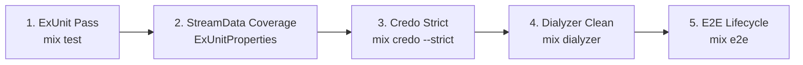

# Definition of Done & Quality Verification

To ensure zero-drift semantic compilation and maintainable code generation, all feature development in `ggen_igniter` must satisfy the five-layer verification gate and the four-criterion scorecard.

Status: **PARTIAL_ALIVE**. Verification gates are active; four-criterion scorecard reflects real observed system boundaries.

---

## 1. Five-Layer Feature Verification Gate

No pull request or feature branch is considered "Done" until all five verification layers pass cleanly:

### Layer 1: ExUnit Unit, Integration & Doctests
- **Command**: `mix test`
- **Criteria**: Zero test failures, zero unexpected warnings. Tests must run without mock libraries and use isolated temporary directories for file mutations.

### Layer 2: StreamData Property Coverage
- **Command**: `mix test --only property`
- **Criteria**: Invariants (idempotency, frontmatter round-trips, cross-engine equivalence, actuation dispatch) must execute at least 100 runs per property without shrinking failures.

### Layer 3: Credo Strict Compliance
- **Command**: `mix credo --strict`
- **Criteria**: Zero software design, code readability, refactoring, or consistency issues.

### Layer 4: Dialyzer Clean
- **Command**: `mix dialyzer`
- **Criteria**: Clean success typing analysis. All public APIs must have valid `@spec` declarations and accurate error tuple definitions.

### Layer 5: End-to-End Lifecycle Pass
- **Command**: `mix e2e` (or `elixir test/e2e/run_e2e.exs`)
- **Criteria**: Complete 8-stage execution against a freshly scaffolded Phoenix/Ash application, verifying resource synthesis, field addition, relationship resolution, Form round-trip, LiveView generation, and compile failure on rename.

---

## 2. Four-Criterion Scorecard

The core architectural claims are evaluated against real observed test evidence:

| Criterion | Target Invariant | Observed Status | Evidence & Known Limits |
|---|---|---|---|
| **1. HumanRepairEdits = 0** | Code generation requires 0 manual fixes after ontology edits. | **PARTIAL_ALIVE** | **Achieved** for directly generated templates and `--on-stale prune` artifact deletion. **Limit**: Renaming an attribute breaks downstream hand-generated LiveViews ([`test/e2e/lifecycle_test.ex`](file:///Users/sac/ggen_igniter/test/e2e/lifecycle_test.ex) Stage 7). No cross-file AST refactoring is performed. |
| **2. PartialInvalidStates = 0** | Failures mid-generation leave 0 corrupted or partial files. | **PARTIAL_ALIVE** | **Achieved** in [`GgenIgniter.Reactors.ReconcileReactor`](file:///Users/sac/ggen_igniter/lib/ggen_igniter/reactors/reconcile_reactor.ex) via `undo/4` compensation reverting file state and matching pre/post hashes. **Limit**: The default pipeline (`use_reactor: false`) does not provide automatic rollback. |
| **3. SerialResult = ConcurrentResult** | Parallel execution produces byte-identical results to serial execution. | **PARTIAL_ALIVE** | **Achieved** for `ReconcileReactor`'s `Task.async_stream/3` multi-target actuation, proven by ETS timestamp overlap and collision refusal. **Limit**: No literal diff test compares sequential vs. concurrent executions of identical multi-target plans. |
| **4. ObservedAshSemantics = ProjectedOntologySemantics** | Generated Ash resources conform strictly to Ash compiler & runtime DSL semantics. | **PARTIAL_ALIVE** | **Achieved** through real Ash compiler checks catching relationship directionality (`source_attribute` vs `destination_attribute`) and runtime `AshPhoenix.Form` tests. **Limit**: Full 8-stage E2E scaffold requires network connectivity. |

---

## 3. Pre-Flight Verification Checklist for Contributors

Before committing changes:
1. [ ] Run `mix format --check-formatted`
2. [ ] Run `mix test`
3. [ ] Run property suites with random and zero seed (`mix test --seed 0`)
4. [ ] Verify that no `Mock` or `Mox` test doubles were introduced (`grep -rn "Mock\|mock(" test/`)
5. [ ] Ensure any newly discovered system constraint or engine quirk is documented in `docs/testing/` and `.ggen_igniter_factory/docs-findings.jsonl`
