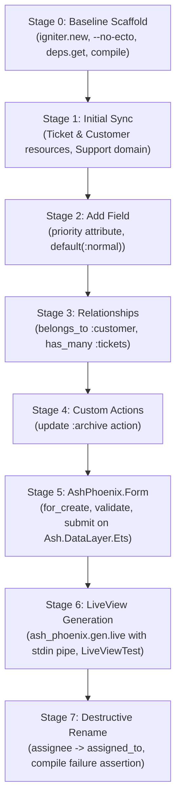

# End-to-End Lifecycle Verification

`test/e2e/lifecycle_test.ex` is the primary, sequential, multi-stage end-to-end integration test for `ggen_igniter`. It scaffolds a real Phoenix, Igniter, and Ash application (`support_desk`) in a temporary directory and executes 8 real, cumulative stages using the `ash-lifecycle-pack` fixture.

Status: **PARTIAL_ALIVE** (Mechanics fully implemented and unit-verified; execution requires a live network connection for Hex/archive installation and takes several minutes).

---

## 1. Architectural Architecture & Design Invariants

Unlike disconnected unit tests, the lifecycle test carries **one continuous application instance through 8 cumulative stages**. This ensures that subsequent modifications (e.g., field additions, relationship definitions, and destructive renames) test true deltas against pre-existing codebase state rather than pristine, isolated graphs.

### Why "support_desk" App Name?
The fixture templates in `test/fixtures/ash-lifecycle-pack/templates/`:
- `resource.ex.eex`: targets `lib/support_desk/support/<%= String.downcase(resource_name) %>.ex`
- `domain.ex.eex`: targets `lib/support_desk/support.ex`

The ontology fixtures define literal module names like `"SupportDesk.Support.Ticket"` and `"SupportDesk.Support"`. The scaffolded application must therefore be named `support_desk` (Elixir module `SupportDesk`, web module `SupportDeskWeb`) for the generated file paths and Ash domain configurations to match.

---

## 2. Stage-by-Stage Breakdown



### Stage 0: Baseline Scaffold
- **Goal**: Establish a pristine Phoenix + Igniter + Ash application before `ggen_igniter` runs.
- **Commands**:
  - `mix archive.install hex phx_new --force`
  - `mix archive.install hex igniter_new --force`
  - `mix igniter.new support_desk --install ash,ash_phoenix --with phx.new --with-args=--no-ecto --yes`
- **Hardened Subprocess Mechanics**:
  - Passes `--with-args=--no-ecto` to avoid generating dead-weight Postgres/Ecto sandbox files (`ConnCase`/`DataCase`) that would fail in a database-less environment.
  - Relaxes scaffolded `:igniter` and `:sourceror` dependencies to eliminate `only: [:dev, :test]` version divergence.
  - Inserts `config :dcatr, env: Mix.env()` required by `:gno`.
  - Registers `config :support_desk, ash_domains: ["SupportDesk.Support"]` to satisfy Ash domain compilation checks.
  - Installs `ash-lifecycle-pack` into `priv/ggen/ash-lifecycle-pack/`.
  - Executes `mix compile --warnings-as-errors` and baseline `mix test`.

### Stage 1: Initial Ontology & Resource Generation
- **Ontology**: `test/fixtures/ash-lifecycle-pack/ontology.ttl` (v1)
- **Sync**:
  - `mix ggen_igniter.sync --pack ash-lifecycle-pack:resource --ontology ontology.ttl --engine sparql`
  - `mix ggen_igniter.sync --pack ash-lifecycle-pack:domain --ontology ontology.ttl --engine sparql`
- **Assertions**:
  - Output files exist: `ticket.ex`, `customer.ex`, `support.ex`.
  - AST validity verified via `Code.string_to_quoted!/1`.
  - Content check: `uuid_primary_key(:id)`, `data_layer: Ash.DataLayer.Ets`, `attribute :subject, :string`, `attribute :status, :atom`, `attribute :assignee, :string`, `defaults([:create, :read, :update, :destroy])`.

### Stage 2: Field Addition (Additive Delta)
- **Ontology**: `ontology_v2_add_attribute.ttl` (adds `alp:TicketPriorityAttribute`).
- **Sync**: Re-runs `mix ggen_igniter.sync` for `resource`.
- **Assertions**:
  - New field present: `attribute :priority, :atom`, `default(:normal)`.
  - Regression check: Old attributes (`:subject`, `:status`, `:assignee`) remain intact.

### Stage 3: Relationship Addition
- **Ontology**: Unchanged relationship definitions across v1/v2.
- **Assertions**:
  - `Ticket` resource contains:
    ```elixir
    belongs_to :customer, SupportDesk.Support.Customer do
      attribute_writable?(true)
      source_attribute(:customer_id)
    end
    ```
  - `Customer` resource contains:
    ```elixir
    has_many :tickets, SupportDesk.Support.Ticket do
      destination_attribute(:customer_id)
    end
    ```
  - *Bug Prevention*: Explicitly verifies `source_attribute` for `belongs_to` vs. `destination_attribute` for `has_many`.

### Stage 4: Custom Action Generation
- **Ontology**: `alp:TicketArchiveAction` (`actionName "archive"`, `actionType "update"`).
- **Assertions**:
  - `Ticket` resource renders an explicit `update :archive do end` block rather than folding it into `defaults(...)`.
  - `Customer` resource does not contain `:archive`.

### Stage 5: AshPhoenix.Form Lifecycle Test
- **Goal**: Validate Ash runtime execution against in-memory ETS data layer without mocking.
- **Implementation**: Writes `test/ggen_igniter_form_lifecycle_test.exs` directly into the scaffolded application.
- **Assertions**:
  - `AshPhoenix.Form.for_create(Support.Ticket, :create, domain: Support)` $\to$ `validate/2` $\to$ `submit/2`.
  - Record persistence and retrieval via `Ash.get!(Support.Ticket, id, domain: Support)`.
  - Subsequent `AshPhoenix.Form.for_update/3` $\to$ `validate/2` $\to$ `submit/2` verification.

### Stage 6: Phoenix LiveView Generation & LiveViewTest
- **Subprocess**: `mix ash_phoenix.gen.live --domain SupportDesk.Support --resource SupportDesk.Support.Ticket --resource-plural tickets --yes`
- **Interactive Stdin Hardening**:
  - `ash_phoenix.gen.live` prompts interactively for multitenancy and update action disambiguation (since `Ticket` has two update actions: `:update` and `:archive`).
  - Feed deterministic inputs (`"n\n"` repeated) via `Port.command/2` in [`GgenIgniter.E2e.Case.cmd!/3`](file:///Users/sac/ggen_igniter/test/e2e/support/e2e_case.ex#L103) to prevent subprocess hangs.
- **Routing & Test Execution**:
  - Injects live routes into `lib/support_desk_web/router.ex`:
    ```elixir
    live "/tickets", TicketLive.Index, :index
    live "/tickets/new", TicketLive.Form, :new
    live "/tickets/:id", TicketLive.Show, :show
    ```
  - Writes `test/ggen_igniter_liveview_lifecycle_test.exs` and executes `mix test` using `Phoenix.LiveViewTest` to mount, render HTML, and submit forms.

### Stage 7: Destructive Rename Verification
- **Ontology**: `ontology_v3_rename.ttl` (`alp:TicketAssigneeAttribute` renamed from `"assignee"` to `"assigned_to"`).
- **Sync**: Re-syncs `resource` template.
- **Assertions**:
  - `ticket.ex` contains `attribute :assigned_to, :string` and no longer contains `attribute :assignee`.
  - **Compile Failure Assertion**:
    ```elixir
    error = assert_raise(RuntimeError, fn -> compile!(app_dir) end)
    assert error.message =~ "assignee"
    ```
  - Verifies that `mix compile --warnings-as-errors` fails loudly because Stage 6's hand-generated LiveViews still reference the old `assignee` struct field. Discloses the honest architectural limit: `ggen_igniter` does not perform cross-file AST refactoring on external consumer code.

---

## 3. Subprocess Port Safety: `GgenIgniter.E2e.Case`

[`test/e2e/support/e2e_case.ex`](file:///Users/sac/ggen_igniter/test/e2e/support/e2e_case.ex) provides robust primitives for running OS-level Mix tasks:

1. **Port Execution (`Port.open/2`)**: Replaces standard `System.cmd/3` to enable interactive stdin piping and deterministic EOF closing.
2. **Hard Timeouts & SIGKILL Cleanup**: Enforces a 120,000ms wall-clock timeout. On expiration, locates the OS PID via `Port.info(port, :os_pid)` and issues `kill -9` to prevent zombie BEAM processes.
3. **Collision-Free Temp Dirs**: Scaffolds into paths combining `System.tmp_dir!()`, `System.pid()`, and `System.unique_integer([:positive])` to guarantee multi-agent and multi-process isolation.
