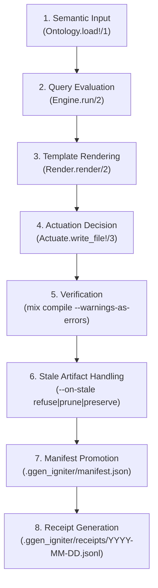

# Understanding the Reconciliation Lifecycle

Semantic code generation is not just a one-off templating tool: it is an ongoing **reconciliation loop**. As domain ontologies evolve—adding fields, renaming resources, or deprecating endpoints—the generated code on disk must safely reflect the desired state without corrupting manually authored files, creating orphaned artifacts, or leaving broken builds.

This tutorial walks through the complete reconciliation lifecycle in GgenIgniter.

---

## 1. The 8-Stage Reconciliation Lifecycle

The diagram below illustrates how an ontology change moves through the reconciliation pipeline:



---

## 2. Deep Dive: Stage by Stage

### Stage 1: Semantic Input (`Ontology.load!/1`)

GgenIgniter reads the RDF Turtle source file (e.g., `ontology.ttl`) into an in-memory `%RDF.Graph{}`. The parser validates syntax, namespace prefixes, IRI structures, and literal datatypes. If the graph is malformed, execution halts immediately before any query runs.

```elixir
graph = GgenIgniter.Ontology.load!("priv/ggen/app/ontology.ttl")
```

### Stage 2: Query Evaluation (`Engine.run/2`)

Named SPARQL queries (`gates/*.rq`) are evaluated against the loaded graph using the active query engine (default: native `oxigraph`):

* Multi-row queries return a list of string-keyed maps (`[%{"field" => "val1"}, %{"field" => "val2"}]`).
* Single-row queries are automatically flattened to atom keys in the top-level template bindings.

```elixir
results = GgenIgniter.Query.Oxigraph.run(graph, sparql_query_string)
```

### Stage 3: Template Rendering (`Render.render/2`)

The EEx template is evaluated against the combined query bindings. In multi-row fan-out (`--for-each <query_name>`), the template is evaluated once per row, and the `--out` destination path template is also rendered dynamically using row bindings.

```elixir
rendered_code = GgenIgniter.Render.render(template_string, bindings)
rendered_path = GgenIgniter.Render.render(out_template, bindings)
```

### Stage 4: Actuation Decision Table (`Actuate.write_file!/3`)

Before touching the filesystem, GgenIgniter applies write-safety guards:

| Existing File State | Options | Decision | Outcome |
|---|---|---|---|
| Does not exist | *(Any)* | **Write** | New file created on disk. |
| Exists | `--unless-exists` | **Skip** | Existing content preserved unconditionally. |
| Exists | `--skip-if <marker>` | **Skip** | If file content contains marker string, write is skipped. |
| Exists | Desired == Current bytes | **No-op** | File is unchanged; modification timestamp is untouched. |
| Exists | Desired != Current bytes | **Overwrite** | Target file updated with newly rendered content. |

```elixir
outcome = GgenIgniter.Actuate.write_file!(target_path, rendered_code, [unless_exists: false])
# => :written | :unchanged | {:skipped, reason}
```

### Stage 5: Verification (`mix compile --warnings-as-errors`)

In verified environments (such as the Reactor coordination path), GgenIgniter triggers a real `mix compile --warnings-as-errors` subprocess. If the generated code causes a compilation error (e.g. invalid syntax, missing dependency, or broken type reference), the failure is caught, actuated files are reverted, and the system fails closed.

### Stage 6: Stale Artifact Handling (`--on-stale`)

When an entity is renamed or deleted from the ontology, previously generated files become "stale" (orphaned). GgenIgniter compares the prior manifest against the current generation plan and applies the configured `--on-stale` policy:

| Policy | Flag | Behavior |
|---|---|---|
| **Refuse** (Default) | `--on-stale refuse` | **Fail-closed**: Raises `ArgumentError` and refuses to proceed if any stale files are detected. Disk and manifest remain untouched. |
| **Prune** | `--on-stale prune` | **Clean deletion**: Deletes stale files from disk (`File.rm/1`) and removes them from the manifest. |
| **Preserve** | `--on-stale preserve` | **Release ownership**: Leaves stale files on disk, issues a warning, and unlinks them from manifest tracking. |

### Stage 7: Manifest Promotion (`Manifest.persist!/2`)

State is recorded in `.ggen_igniter/manifest.json`. GgenIgniter uses an atomic rename protocol (writing to `.tmp-<id>` then swapping via `File.rename!/2`) to prevent corrupt state if the process crashes mid-write.

A manifest entry records:
* Recipe key (`"template_path=>out_template"`)
* Tracked output file paths
* Sha256 digests of generated content
* Last reconciled timestamp

### Stage 8: Durable Receipt Generation (`Receipt.append!/2`)

Every reconciliation run appends an audit record to `.ggen_igniter/receipts/<YYYY-MM-DD>.jsonl`. The receipt captures:
* Execution standing (`:alive`, `:refused`, `:compensated`, `:build_broken`)
* Pre-run and post-run project hashes
* List of modified files
* Structured OCEL event trail

---

## 3. Hands-On Walkthrough: Destructive Evolution

Let's observe reconciliation in action through an ontology evolution scenario.

### Step 1: Initial Generation (Version 1)

Suppose our ontology defines a `User` resource:

```bash
mix ggen_igniter.sync \
  --ontology ontology_v1.ttl \
  --query spec=spec.rq \
  --for-each resources \
  --template resource.ex.eex \
  --out "lib/app/<%= name %>.ex" \
  --on-stale prune
```

**Result:**
* Created `lib/app/user.ex`
* Created `.ggen_igniter/manifest.json` tracking `lib/app/user.ex`

### Step 2: Idempotent Re-run (Zero Drift)

Running the exact same command a second time:

```bash
mix ggen_igniter.sync \
  --ontology ontology_v1.ttl \
  --query spec=spec.rq \
  --for-each resources \
  --template resource.ex.eex \
  --out "lib/app/<%= name %>.ex"
```

**Result:**
* GgenIgniter detects byte-level equality.
* Output: `unchanged: lib/app/user.ex`
* Manifest file is byte-for-byte identical; disk mtime is preserved.

### Step 3: Renaming a Resource (Version 2)

Now suppose the ontology is updated to rename `User` to `Account`:

```turtle
# ontology_v2.ttl
ex:Account a ex:Resource ;
    ex:name "account" .
```

Let's test what happens under different `--on-stale` policies:

#### Scenario A: Default Policy (`--on-stale refuse`)

```bash
mix ggen_igniter.sync \
  --ontology ontology_v2.ttl \
  --query spec=spec.rq \
  --for-each resources \
  --template resource.ex.eex \
  --out "lib/app/<%= name %>.ex" \
  --on-stale refuse
```

**Result:**
```text
** (ArgumentError) reconciliation refused: stale output path(s) detected from previous run:
  - lib/app/user.ex
Pass --on-stale prune to delete stale outputs, or --on-stale preserve to retain them.
```
The operation is refused before modifying any file on disk.

#### Scenario B: Pruning Policy (`--on-stale prune`)

```bash
mix ggen_igniter.sync \
  --ontology ontology_v2.ttl \
  --query spec=spec.rq \
  --for-each resources \
  --template resource.ex.eex \
  --out "lib/app/<%= name %>.ex" \
  --on-stale prune
```

**Result:**
* `lib/app/account.ex` is created.
* `lib/app/user.ex` is cleanly pruned (deleted) from disk.
* `.ggen_igniter/manifest.json` updates to track `lib/app/account.ex`.

---

## 4. Inspecting `.ggen_igniter/manifest.json`

The manifest file provides an honest, human-readable JSON inspection of managed files:

```json
{
  "version": 1,
  "updated_at": "2026-08-27T22:30:00Z",
  "entries": {
    "priv/ggen/app/templates/resource.ex.eex=>lib/app/<%= name %>.ex": {
      "template_path": "priv/ggen/app/templates/resource.ex.eex",
      "out_template": "lib/app/<%= name %>.ex",
      "outputs": {
        "lib/app/account.ex": {
          "sha256": "e3b0c44298fc1c149afbf4c8996fb92427ae41e4649b934ca495991b7852b855",
          "reconciled_at": "2026-08-27T22:30:00Z"
        }
      }
    }
  }
}
```

---

## 5. Next Steps

* [The Reactor Coordination Path](file:///Users/sac/ggen_igniter/docs/tutorials/reactor-path.md) — Learn how to coordinate multi-target reconciliations with transactional rollback and OCEL event telemetry.
