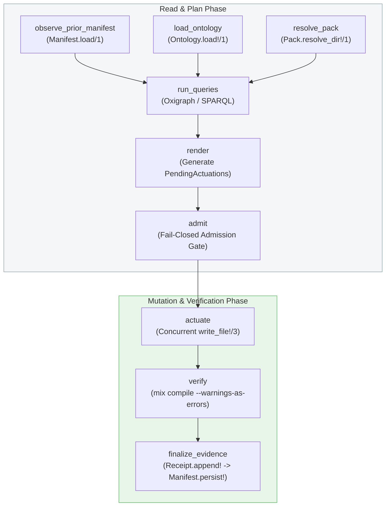

# The Reactor Coordination Path

While the default reconciliation pipeline executes as a straightforward Elixir function chain, production environments and complex multi-target codebases often require **transactional safety**, **concurrency**, **automated rollback**, and **durable audit trails**.

GgenIgniter provides an advanced, opt-in coordination engine built with Ash's underlying [Reactor](https://hexdocs.pm/reactor) workflow library: **`GgenIgniter.Reactors.ReconcileReactor`**.

> [!NOTE]
> `ReconcileReactor` uses plain `Reactor` (not `Ash.Reactor`), ensuring GgenIgniter remains completely dependency-free of the Ash framework at runtime.

---

## 1. Why Use the Reactor Path?

The Reactor coordinator provides four primary operational guarantees:

1. **Plan-Then-Actuate Boundary**: Rendering produces a `%GgenIgniter.PendingActuation{}` intermediate representation before touching disk. Ambiguous output paths or unowned delete operations are refused before any file is touched.
2. **Concurrent Multi-Target Actuation**: When generating multiple output targets, file writes are executed concurrently via `Task.async_stream/3`.
3. **Automated Compensation & Reversion (`undo/4`)**: If verification (`mix compile --warnings-as-errors`) fails after writing files to disk, Reactor triggers the `:actuate` step's `undo/4` callback to restore all touched files to their exact pre-run byte state.
4. **Durable Process Receipts on Every Path**: Whether a run succeeds (`:alive`), is rejected at admission (`:refused`), is restored after error (`:compensated`), or breaks the build (`:build_broken`), a durable receipt is persisted to `.ggen_igniter/receipts/<YYYY-MM-DD>.jsonl`.

---

## 2. Enabling the Reactor Path

You can use the Reactor coordinator in two ways:

### Method A: Application Configuration (Recommended for CLI)

In your project's `config/config.exs` or `config/dev.exs`:

```elixir
import Config

config :ggen_igniter,
  use_reactor: true
```

When `use_reactor: true` is configured, standard CLI tasks (`mix ggen_igniter.sync`) automatically route execution through `GgenIgniter.Reactors.ReconcileReactor`.

### Method B: Programmatic Invocation (`ReconcileReactor.run/1`)

In custom Mix tasks, CI scripts, or Elixir code, invoke `ReconcileReactor.run/1` directly:

```elixir
alias GgenIgniter.Reactors.ReconcileReactor

opts = [
  ontology: "priv/ggen/service-pack/ontology.ttl",
  query: "spec=priv/ggen/service-pack/gates/010_service.rq",
  query: "endpoints=priv/ggen/service-pack/gates/020_endpoints.rq",
  template: "priv/ggen/service-pack/templates/service.ex.eex",
  out: "lib/demo_app/service.ex",
  manifest_dir: File.cwd!()
]

case ReconcileReactor.run(opts) do
  {:ok, receipt} ->
    IO.puts("Reconciliation succeeded with standing: #{receipt.standing}")
    IO.puts("Receipt ID: #{receipt.id}")

  {:error, receipt} ->
    IO.puts("Reconciliation halted with standing: #{receipt.standing}")
    IO.puts("Reason: #{receipt.reason}")
end
```

---

## 3. The 9-Step Reactor Topology

`ReconcileReactor` executes a 9-step directed acyclic graph (DAG):



### Step Descriptions

1. **`observe_prior_manifest`**: Reads `.ggen_igniter/manifest.json` (runs concurrently with ontology loading).
2. **`load_ontology`**: Parses the RDF Turtle ontology into an `%RDF.Graph{}`.
3. **`resolve_pack`**: Resolves pack directories and defaults.
4. **`run_queries`**: Evaluates SPARQL gate queries across all targets.
5. **`render`**: Evaluates templates into memory and constructs the pending action plan (`[%PendingActuation{}]`).
6. **`admit`**: Inspects the entire pending plan before any writes occur. Refuses collisions, duplicate output paths, or unowned deletions.
7. **`actuate`**: The **single filesystem mutation step**. Writes files concurrently via `Task.async_stream/3`. Captures pre-image file contents for rollback.
8. **`verify`**: Runs a real `mix compile --warnings-as-errors` subprocess against the target project.
9. **`finalize_evidence`**: Persists the durable receipt (`Receipt.append!/2`) **strictly before** promoting the manifest (`Manifest.persist!/2`), ensuring evidence is never lost.

---

## 4. Multi-Target Actuation with Concurrency

`ReconcileReactor` supports multi-target batching via the `:targets` option:

```elixir
opts = [
  ontology: "priv/ggen/service-pack/ontology.ttl",
  targets: [
    [
      query: "spec=priv/ggen/service-pack/gates/010_service.rq",
      template: "priv/ggen/service-pack/templates/service.ex.eex",
      out: "lib/demo_app/service.ex"
    ],
    [
      query: "spec=priv/ggen/service-pack/gates/010_service.rq",
      template: "priv/ggen/service-pack/templates/router.ex.eex",
      out: "lib/demo_app/router.ex"
    ]
  ]
]

{:ok, receipt} = ReconcileReactor.run(opts)
```

In `:actuate`, both files are written concurrently with overlapping I/O windows, validated, and recorded in a single atomic receipt.

---

## 5. Fault Compensation & Automated Rollback

Consider a scenario where a template has a typo or generates invalid Elixir code:

```elixir
# Broken template: references undefined module
defmodule DemoApp.Broken do
  @behaviour NonExistentModule.Behaviour
end
```

When `ReconcileReactor.run/1` runs:

1. `:render` generates the broken code in memory.
2. `:admit` admits the action.
3. `:actuate` writes `lib/demo_app/broken.ex` to disk and records pre-actuation disk state.
4. `:verify` runs `mix compile --warnings-as-errors`, which fails with a `CompileError`.
5. **Reactor automatically triggers `:actuate`'s `undo/4` callback**.
6. `undo/4` restores the filesystem to its exact pre-run byte state.
7. `ReconcileReactor.run/1` persists a receipt with standing `:build_broken`, documenting the failed attempt, compiler output, and proving that pre-run and post-run project hashes match.

### Inspecting the Failure Receipt

```json
{
  "id": "rcpt_9f1a2b3c4d5e6f70",
  "standing": "build_broken",
  "started_at": "2026-08-27T22:45:00Z",
  "finished_at": "2026-08-27T22:45:02Z",
  "pre_run_hash": "sha256:4f53cda18c2baa0c0354bb5f9a3ecbe5ed12ab4d8e11ba873c2f11161202b945",
  "post_run_hash": "sha256:4f53cda18c2baa0c0354bb5f9a3ecbe5ed12ab4d8e11ba873c2f11161202b945",
  "files": ["lib/demo_app/broken.ex"],
  "reason": "verification failed (mix compile): module NonExistentModule.Behaviour is not loaded",
  "metadata": {
    "failed_step": ":verify"
  }
}
```

---

## 6. The Four Standings Taxonomy

Every execution processed by `ReconcileReactor` produces one of four closed-set standing atoms:

| Standing | Meaning | Filesystem State | Manifest State |
|---|---|---|---|
| `:alive` | All steps (admit, actuate, verify, evidence) succeeded cleanly. | Updated with desired content. | Promoted to new version. |
| `:refused` | Pre-actuation check failed (duplicate paths, unowned deletions, syntax error). | Untouched (zero writes attempted). | Untouched. |
| `:compensated` | Post-actuation failure occurred; files were cleanly restored by `undo/4`. | Restored to pre-run state (`pre_run_hash == post_run_hash`). | Untouched. |
| `:build_broken` | Specifically a compiler verification failure (`:verify`); files were restored. | Restored to pre-run state. | Untouched. |

---

## 7. Summary

The Reactor coordination path upgrades GgenIgniter from a templating tool to an enterprise-grade semantic transaction manager. By combining formal IR planning, concurrent actuation, automated rollback, and immutable audit receipts, it guarantees that code generation never leaves your repository in a broken or unverifiable state.
